# ArxOS Development Plan

**Version**: 3.0
**Created**: September 17, 2025
**Updated**: September 17, 2025
**Status**: In Progress - PostGIS Architecture Implementation

## 🎯 Executive Summary

ArxOS has a **strong architectural foundation** with well-designed interfaces and patterns aligned with our PostGIS-centric professional BIM integration vision. The main gaps are **missing implementations** rather than architectural misalignments. This unified plan incorporates gap analysis findings into actionable development tasks.

**Overall Assessment**: 🟡 **Foundation Strong, Implementation Required**

## 🏗️ Architecture Philosophy

**PostGIS as Single Source of Truth**: All spatial data (AR, LiDAR, IFC imports) flows into PostGIS database for authoritative storage and spatial operations.

**IFC as Universal Interface**: Professional BIM tools (Revit, AutoCAD, ArchiCAD, Tekla) integrate via standard IFC files - no tool-specific code needed.

**Derived Outputs**: .bim.txt files and other formats are generated from PostGIS data, not maintained as separate sources of truth.

**Professional Workflow Integration**: Daemon monitors IFC exports from any BIM tool, automatically updating PostGIS and regenerating collaborative formats.

## 📊 Current State & Gap Analysis

### Component Status Overview

| Priority | Component | Current State | Gap | Impact |
|----------|-----------|---------------|-----|--------|
| 🚨 **Critical** | PostGIS Database | Schema only, no connection | Missing implementation | Blocks all spatial operations |
| 🔶 **High** | IFC → PostGIS Pipeline | Parser exists, no DB output | Missing database integration | Blocks professional workflow |
| 🔶 **High** | Professional BIM Daemon | Framework ready, not implemented | IFC processing TODO | Blocks professional adoption |
| 🔶 **Medium** | CLI Spatial Commands | Structure ready, no spatial flags | Missing spatial parameters | Limits spatial control |
| ✅ **Complete** | Query System | Full SQL engine with filters | Working | Foundation complete |

### Architecture Strengths

- **HybridDB Design**: PostGIS-primary with SQLite fallback ready
- **Spatial Interface**: Comprehensive spatial operation definitions
- **Converter System**: IFC parser and PDF extraction working
- **Daemon Infrastructure**: File monitoring and worker system ready
- **Development Patterns**: Clean interfaces, proper Go patterns

## 🚀 Implementation Plan

### Phase 1: PostGIS Core Foundation (Week 1)

**Duration**: 5 days
**Priority**: 🚨 Critical - Blocks all spatial features

#### Task 1.1: Database Query Engine ✅
- **Status**: COMPLETED
- **Files**: `internal/commands/query.go`, `internal/commands/query_test.go`

#### Task 1.2: PostGIS Database Implementation
**Duration**: 2 days
**Priority**: Critical

##### Implementation Steps:
1. **Add PostgreSQL driver** to `go.mod`
   ```go
   require (
       github.com/lib/pq v1.10.9  // or github.com/jackc/pgx/v5
   )
   ```

2. **Create PostGIS implementation** (`internal/database/postgis.go`)
   ```go
   package database

   type PostGISDB struct {
       db *sql.DB
       config PostGISConfig
   }

   func (p *PostGISDB) Connect(ctx context.Context, config PostGISConfig) error
   func (p *PostGISDB) QuerySpatial(ctx context.Context, query SpatialQuery) (*SpatialResult, error)
   func (p *PostGISDB) StoreEquipment(ctx context.Context, eq *Equipment, coords Point3D) error
   ```

3. **Implement spatial queries**
   - ST_Distance for proximity queries
   - ST_Contains for containment
   - ST_DWithin for radius searches
   - Spatial indexing setup

**Files to Create/Modify**:
- [ ] `internal/database/postgis.go` (NEW)
- [ ] `internal/database/postgis_test.go` (NEW)
- [ ] `go.mod` (ADD PostgreSQL driver)
- [ ] `internal/database/hybrid.go` (CONNECT PostGIS)

#### Task 1.3: Wire HybridDB to Query System
**Duration**: 1 day
**Priority**: Critical

**Implementation**:
- Connect query command to HybridDB
- Add PostGIS detection and fallback logic
- Test spatial query execution

**Files to Modify**:
- [ ] `internal/commands/query.go` (USE HybridDB)
- [ ] `cmd/arx/cmd_query.go` (INIT HybridDB)

#### Task 1.4: CLI Spatial Query Flags
**Duration**: 2 days
**Priority**: High

**Add Spatial Flags**:
```bash
arx query --near "12.5,8.3,1.1" --radius 2.0
arx query --within "building_boundary"
arx query --contains "room_polygon"
```

**Files to Modify**:
- [ ] `cmd/arx/cmd_query.go` (ADD spatial flags)
- [ ] `internal/commands/query.go` (BUILD spatial queries)
- [ ] `internal/commands/query_test.go` (TEST spatial queries)

### Phase 2: IFC → PostGIS Pipeline (Week 1-2)

**Duration**: 4 days
**Priority**: 🔶 High - Enables professional workflow

#### Task 2.1: Converter Database Interface
**Duration**: 1 day
**Priority**: High

**Extend Converter Interface**:
```go
type Converter interface {
    ConvertToBIM(input io.Reader, output io.Writer) error
    ConvertToDB(input io.Reader, db SpatialDB) error  // NEW
}
```

**Files to Modify**:
- [ ] `internal/converter/converter.go` (ADD DB interface)
- [ ] `internal/converter/types.go` (ADD spatial types)

#### Task 2.2: IFC Spatial Extraction
**Duration**: 2 days
**Priority**: High

**Implementation**:
- Extract 3D coordinates from IFC entities
- Map IFC coordinate system to PostGIS
- Handle IFC units and transformations

**Files to Modify**:
- [ ] `internal/converter/ifc_improved.go` (ADD spatial extraction)
- [ ] `internal/converter/ifc_spatial.go` (ENHANCE coordinate handling)

#### Task 2.3: IFC → PostGIS Import
**Duration**: 1 day
**Priority**: High

**Connect Pipeline**:
```go
func (c *ImprovedIFCConverter) ConvertToDB(input io.Reader, db SpatialDB) error {
    entities := c.parseIFCEntities(input)
    for _, entity := range entities {
        coords := c.extractSpatialCoordinates(entity)
        db.StoreEquipment(entity, coords)
    }
}
```

**Files to Modify**:
- [ ] `internal/converter/ifc_improved.go` (IMPLEMENT ConvertToDB)
- [ ] `internal/commands/import_v2.go` (USE DB import)

### Phase 3: Professional BIM Integration (Week 2)

**Duration**: 5 days
**Priority**: 🔶 High - Key differentiator

#### Task 3.1: Daemon IFC Processing
**Duration**: 2 days
**Priority**: High

**Implementation**:
- Connect daemon to IFC converter
- Automatic PostGIS import on file detection
- Error handling and retry logic

**Files to Modify**:
- [ ] `internal/daemon/daemon.go` (IMPLEMENT IFC processing)
- [ ] `internal/daemon/worker.go` (ADD import job type)

#### Task 3.2: Professional CLI Commands
**Duration**: 1 day
**Priority**: High

**Add Professional Commands**:
```bash
arx install --professional --with-daemon
arx daemon watch --ifc "C:\Projects\*.ifc"
arx daemon status --show-integrations
```

**Files to Modify**:
- [ ] `cmd/arx/cmd_daemon.go` (IMPLEMENT commands)
- [ ] `cmd/arx/cmd_install.go` (ADD professional mode)

#### Task 3.3: CLI Spatial CRUD Commands
**Duration**: 2 days
**Priority**: Medium

**Add Spatial Parameters**:
```bash
arx add /3/A/301/E/OUTLET_02 --location "12.547,8.291,1.127"
arx update OUTLET_02 --move-by "0.05,0,0"
```

**Files to Modify**:
- [ ] `cmd/arx/cmd_crud.go` (ADD location flags)
- [ ] `internal/commands/crud.go` (IMPLEMENT spatial updates)

### Phase 4: Export & Generation Pipeline (Week 2-3)

**Duration**: 4 days
**Priority**: Medium - Enables collaboration

#### Task 4.1: PostGIS → BIM Generation
**Duration**: 1 day
**Priority**: Medium

**Implementation**:
- Query PostGIS for all equipment
- Convert to grid coordinates
- Generate .bim.txt format

**Files to Create**:
- [ ] `internal/exporter/bim_generator.go` (NEW)
- [ ] `internal/exporter/bim_generator_test.go` (NEW)

#### Task 4.2: Multi-Format Export
**Duration**: 2 days
**Priority**: Medium

**Formats**:
- CSV/JSON data exports for reporting
- Equipment status reports
- Maintenance schedules

**Files to Create**:
- [ ] `internal/exporter/csv_exporter.go` (NEW)
- [ ] `internal/exporter/json_exporter.go` (NEW)
- [ ] `internal/exporter/report_generator.go` (NEW)

#### Task 4.3: Automatic Export Generation
**Duration**: 1 day
**Priority**: Medium

**Implementation**:
- Trigger exports on PostGIS changes
- Git integration for version control
- Daemon-based automation

**Files to Create**:
- [ ] `internal/daemon/auto_export.go` (NEW)

### Phase 5: Testing & Integration (Week 3)

**Duration**: 5 days
**Priority**: High - Ensure reliability

#### Task 5.1: Integration Testing
**Duration**: 2 days
**Priority**: High

**Test Scenarios**:
- End-to-end IFC import → PostGIS → Export
- Professional daemon workflow
- Multi-user concurrent access

**Files to Create**:
- [ ] `internal/integration/postgis_test.go` (NEW)
- [ ] `internal/integration/professional_workflow_test.go` (NEW)

#### Task 5.2: Performance Testing
**Duration**: 2 days
**Priority**: Medium

**Benchmarks**:
- PostGIS spatial query performance
- IFC import speed (target: <30s)
- Export generation time (target: <15s)

**Files to Create**:
- [ ] `internal/performance/postgis_bench_test.go` (NEW)
- [ ] `internal/performance/ifc_bench_test.go` (NEW)

#### Task 5.3: Component Integration
**Duration**: 1 day
**Priority**: High

**Connect All Systems**:
- Configuration loading
- Service initialization
- Error propagation

**Files to Modify**:
- [ ] `internal/config/config.go` (LOAD PostGIS settings)
- [ ] `cmd/arx/main.go` (INIT all systems)

## 🗓️ Critical Path & Dependencies

```mermaid
graph TD
    A[PostGIS Implementation] --> B[HybridDB Connection]
    B --> C[Spatial Query Commands]
    A --> D[IFC Spatial Extraction]
    D --> E[IFC → PostGIS Import]
    E --> F[Daemon IFC Processing]
    E --> G[PostGIS → BIM Export]
    F --> H[Professional Workflow]
    G --> H
    C --> H
```



## ⚠️ Risk Mitigation

### Technical Risks

| Risk | Mitigation |
|------|-----------|
| PostGIS complexity | Start with basic queries, incrementally add spatial functions |
| IFC variations | Test with samples from Revit, AutoCAD, ArchiCAD |
| Performance issues | Profile early, optimize critical paths |
| Integration failures | Comprehensive error handling, fallback to SQLite |

## 📈 Success Metrics

### Week 1 Deliverables
- [ ] PostGIS connection working
- [ ] Spatial queries via CLI functional
- [ ] IFC imports to PostGIS

### Week 2 Deliverables
- [ ] Professional daemon processing IFC files
- [ ] Spatial CRUD commands working
- [ ] Export pipeline operational

### Week 3 Deliverables
- [ ] All integration tests passing
- [ ] Performance targets met
- [ ] Professional workflow documented

### Performance Targets
- **PostGIS Queries**: <50ms for 10K equipment
- **IFC Import**: <30s for typical building
- **Export Generation**: <15s for .bim.txt
- **Daemon Response**: <5s file detection

## 🔄 Implementation Checklist

### Immediate Actions (Day 1)
- [ ] Add PostgreSQL driver to go.mod
- [ ] Create internal/database/postgis.go skeleton
- [ ] Set up local PostGIS for development
- [ ] Create test IFC files

### Week 1 Focus
- [ ] Complete PostGIS implementation
- [ ] Wire HybridDB to queries
- [ ] Add spatial CLI flags
- [ ] Begin IFC spatial extraction

### Week 2 Focus
- [ ] Complete IFC → PostGIS pipeline
- [ ] Implement daemon processing
- [ ] Add spatial CRUD commands
- [ ] Create export pipeline

### Week 3 Focus
- [ ] Integration testing
- [ ] Performance optimization
- [ ] Documentation
- [ ] Professional workflow validation

## 📝 Development Guidelines

### Code Organization
```go
// PostGIS implementation follows interface pattern
type PostGISDB struct {
    db *sql.DB
    config PostGISConfig
}

// Implement SpatialDB interface
func (p *PostGISDB) QueryBySpatialProximity(center Point3D, radius float64) ([]Equipment, error)

// Use contexts for all DB operations
func (p *PostGISDB) Connect(ctx context.Context, config PostGISConfig) error
```

### Testing Strategy
- Unit tests for each component
- Integration tests for workflows
- Benchmark tests for performance
- Use testcontainers for PostGIS tests

### Error Handling
- Graceful PostGIS → SQLite fallback
- Detailed error messages for debugging
- User-friendly error output in CLI

## 🎯 Next Steps

1. **Set up development environment**
   - Install PostgreSQL/PostGIS locally or via Docker
   - Prepare sample IFC files
   - Configure IDE for Go development

2. **Begin Task 1.2: PostGIS Implementation**
   - Add PostgreSQL driver
   - Create database connection
   - Implement basic spatial queries

3. **Validate approach with simple prototype**
   - Test PostGIS connection
   - Verify spatial query execution
   - Confirm HybridDB switching works

---

**Change Log**

| Date | Version | Changes |
|------|---------|---------|
| 2025-09-17 | 1.0 | Initial development plan |
| 2025-09-17 | 2.0 | PostGIS-centric refactor |
| 2025-09-17 | 3.0 | Unified with gap analysis, detailed implementation steps |

---

**Critical Success Factor**: PostGIS implementation is the foundation. All other features depend on this spatial database core.