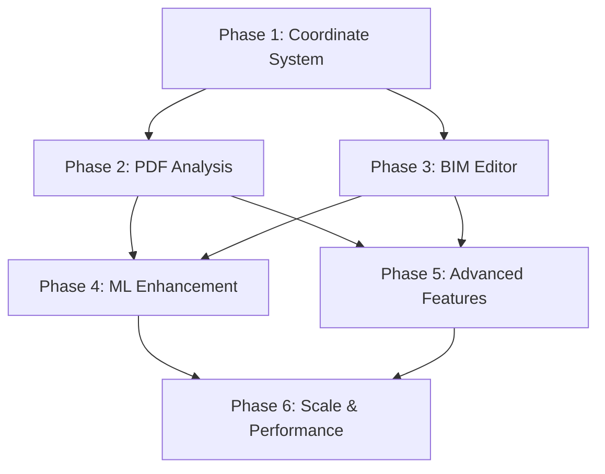

# Arxos Engineering Plan: 1:1 PDF to BIM Conversion
## Priority-Based Implementation Roadmap

### Overview
Transform PDF building plans into accurate, interactive Building Information Models (BIM) using ArxObjects with nanometer precision. Each phase builds upon the previous, creating a robust foundation for planet-scale building digitization.

---

## Phase 1: Foundation - Coordinate System & Data Model (Week 1)
**Priority: CRITICAL - Everything depends on this**

### 1.1 Implement Proper Coordinate System
```python
class CoordinateSystem:
    # PDF space (pixels) -> Document space (points) -> World space (nanometers)
    pdf_to_world_transform: Transform
    scale_factor: float  # e.g., 1/4" = 1'-0"
    origin: Point3D      # Building origin in world coordinates
    units: str           # imperial/metric
```

### 1.2 Enhance ArxObject Model
- Add `dimensions` field with real-world measurements
- Implement `bounds` for accurate bounding boxes
- Add `transform` matrix for rotation/scale
- Implement `parent/children` relationships

### 1.3 Fix Current Data Pipeline
- Ensure all coordinates flow correctly: PDF → AI → Backend → Frontend
- Implement proper serialization without data loss
- Add validation at each step

**Deliverables:**
- Updated ArxObject model with proper coordinate handling
- Coordinate transformation utilities
- Tests validating nanometer precision

---

## Phase 2: Intelligent PDF Analysis (Week 2-3)
**Priority: HIGH - Core functionality**

### 2.1 Multi-Strategy PDF Processing
```python
class PDFProcessor:
    def process(self, pdf):
        # Try in order of accuracy:
        1. vector_data = extract_vector_graphics()  # Best: actual CAD data
        2. text_data = extract_text_and_dimensions()
        3. raster_data = process_raster_image()
        
        return merge_and_validate(vector_data, text_data, raster_data)
```

### 2.2 Implement Component Recognizers
- **Wall Detector**: Parallel lines, thickness patterns
- **Room Extractor**: Closed polygons, area calculation
- **Door/Window Finder**: Standard symbols, breaks in walls
- **Dimension Parser**: Extract measurements, scale indicators
- **Text Analyzer**: Room labels, annotations, title block

### 2.3 Add Topology Understanding
- Build spatial graph of connections
- Understand "touches", "contains", "intersects" relationships
- Maintain wall continuity through doors/windows

**Deliverables:**
- Component detection pipeline
- Accuracy metrics dashboard
- Test suite with various PDF types

---

## Phase 3: Interactive BIM Editor (Week 3-4)
**Priority: HIGH - User experience**

### 3.1 Enhance SVG Viewer
```javascript
class BIMViewer {
    // Core interactions
    - Pan: Mouse drag or arrow keys
    - Zoom: Mouse wheel or pinch
    - Select: Click or box select
    - Multi-select: Shift+click or Ctrl+click
    
    // Object manipulation
    - Move: Drag selected objects
    - Resize: Drag handles
    - Rotate: Rotation handle or keyboard
    - Snap: Grid and object snapping
}
```

### 3.2 Implement Property Inspector
```javascript
class PropertyInspector {
    // Display when object selected:
    - Type, ID, dimensions
    - Real-world measurements
    - Confidence scores
    - Relationships
    
    // Allow editing:
    - Dimensions
    - Type classification
    - Custom properties
}
```

### 3.3 Add Editing Tools
- Wall drawing tool
- Room creation tool
- Dimension tool
- Annotation tool
- Undo/redo system

**Deliverables:**
- Fully interactive BIM viewer
- Property editing capability
- Change tracking system

---

## Phase 4: Machine Learning Enhancement (Week 4-5)
**Priority: MEDIUM - Accuracy improvement**

### 4.1 Training Data Collection
- Store successful conversions as training data
- Implement feedback loop for corrections
- Build symbol library from processed PDFs

### 4.2 Component Classification Model
```python
class ComponentClassifier:
    def classify(self, image_patch, context):
        # CNN for visual classification
        # Context from surrounding elements
        # Confidence scoring
        return ComponentType, confidence
```

### 4.3 Pattern Learning System
- Learn typical dimensions for components
- Understand building conventions
- Detect and apply patterns

**Deliverables:**
- ML model for component classification
- Pattern recognition system
- Confidence improvement metrics

---

## Phase 5: Advanced Features (Week 5-6)
**Priority: MEDIUM - Enhanced functionality**

### 5.1 Layer Management
- Separate structural, electrical, plumbing, HVAC
- Show/hide layers
- Layer-specific editing

### 5.2 3D Projection
- Extrude 2D plans to 3D
- Floor-to-floor connections
- Basic 3D visualization

### 5.3 Validation System
- Building code compliance checks
- Dimension validation
- Relationship integrity

**Deliverables:**
- Layer system
- 3D preview capability
- Validation reports

---

## Phase 6: Scale & Performance (Week 6-7)
**Priority: LOW initially, CRITICAL for production**

### 6.1 Optimization
- Tile-based rendering for large buildings
- Progressive loading
- WebGL acceleration

### 6.2 Multi-Page Support
- Handle multi-story buildings
- Sheet references
- Cross-sheet relationships

### 6.3 Collaboration Features
- Real-time multi-user editing
- Change tracking
- Version control

**Deliverables:**
- Performance benchmarks
- Collaboration system
- Scale testing results

---

## Implementation Order & Dependencies



## Success Metrics

### Phase 1
- ✓ Coordinates preserve precision through pipeline
- ✓ Real-world dimensions accurate to 1mm

### Phase 2  
- ✓ 90%+ accuracy on wall detection
- ✓ 85%+ accuracy on room detection
- ✓ Extract scale from 95%+ of PDFs

### Phase 3
- ✓ < 50ms response time for interactions
- ✓ Support 1000+ objects without lag

### Phase 4
- ✓ 95%+ classification accuracy
- ✓ Reduce manual corrections by 70%

### Phase 5
- ✓ Support all standard building systems
- ✓ Generate valid 3D from 2D plans

### Phase 6
- ✓ Handle 100,000+ objects
- ✓ Support 100+ concurrent users

---

## Risk Mitigation

1. **PDF Variability**: Build robust fallbacks, extensive testing
2. **Scale Challenges**: Design for horizontal scaling from start
3. **Accuracy Requirements**: Implement confidence scoring, human validation
4. **Browser Limitations**: Consider WebAssembly for compute-intensive tasks

---

## Next Immediate Steps

1. **Today**: Fix coordinate system (Phase 1.1)
2. **Tomorrow**: Implement proper PDF vector extraction (Phase 2.1)
3. **This Week**: Get pan/zoom/select working (Phase 3.1)
4. **Next Week**: Add room detection (Phase 2.2)

This plan ensures each phase provides immediate value while building toward the complete vision of planet-scale building digitization.