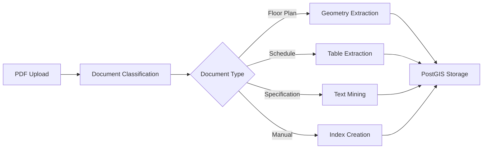

# PDF Service Architecture for ArxOS

## Executive Summary

This document outlines the architecture and implementation strategy for integrating a PDF processing service as a sister service to the existing IFC service within ArxOS. The PDF service will handle 2D architectural drawings, specifications, equipment schedules, and building documentation, complementing the IFC service's 3D BIM model processing capabilities.

## Business Requirements

### Core Objectives
- Process architectural PDFs (blueprints, floor plans, specifications)
- Extract structured data from equipment schedules and tables
- OCR capability for scanned/legacy building documents
- Convert building documentation into searchable, queryable data
- Integrate extracted data with ArxOS's PostGIS spatial database

### Use Cases
1. **Equipment Schedule Extraction**: Parse HVAC, electrical, plumbing schedules into database entries
2. **Floor Plan Analysis**: Extract room boundaries, door locations, equipment positions
3. **Specification Mining**: Extract component specifications, model numbers, capacities
4. **Compliance Documentation**: Process certificates, inspection reports, warranties
5. **Maintenance Manual Indexing**: Make equipment manuals searchable and linked to components

## Technical Architecture

### Service Design Pattern
Following the established IFC service pattern, the PDF service will:
- Run as an independent microservice within the monorepo
- Communicate via HTTP/REST APIs with the Go core
- Implement circuit breaker and fallback mechanisms
- Maintain language independence (Python-based service, Go client)

### High-Level Architecture

```
┌─────────────────────────────────────────────────────────────────┐
│                        ArxOS Platform                           │
├─────────────────────────────────────────────────────────────────┤
│                    ArxOS Core (Go)                              │
│  ┌─────────────────────────────────────────────────────────┐   │
│  │            Infrastructure Layer                          │   │
│  │  ┌──────────────────┐    ┌──────────────────┐          │   │
│  │  │   IFC Service     │    │   PDF Service     │          │   │
│  │  │   Integration     │    │   Integration     │          │   │
│  │  └──────────────────┘    └──────────────────┘          │   │
│  └─────────────────────────────────────────────────────────┘   │
├─────────────────────────────────────────────────────────────────┤
│                    Service Layer                                │
│  ┌──────────────────────┐    ┌──────────────────────┐          │
│  │  IFC Service (Python) │    │  PDF Service (Python) │          │
│  │  • 3D BIM Models      │    │  • 2D Drawings        │          │
│  │  • Spatial Geometry   │    │  • Documentation      │          │
│  │  • Building Systems   │    │  • Schedules/Tables   │          │
│  └──────────────────────┘    └──────────────────────┘          │
├─────────────────────────────────────────────────────────────────┤
│                 Unified Data Layer (PostGIS)                    │
└─────────────────────────────────────────────────────────────────┘
```

## Technology Stack Selection

### Primary Stack Recommendation

| Component | Technology | Rationale |
|-----------|-----------|-----------|
| **Core PDF Library** | PyMuPDF (fitz) | Fast, comprehensive, handles both text and graphics well |
| **Table Extraction** | Camelot | Superior handling of complex architectural schedules |
| **OCR Engine** | Tesseract + OCRmyPDF | Industry standard, excellent for scanned blueprints |
| **Floor Plan Analysis** | OpenCV (optional) | Advanced pattern recognition for architectural symbols |
| **API Framework** | FastAPI | High performance, automatic OpenAPI docs, async support |
| **Task Queue** | Celery + Redis | Handle large PDF processing jobs asynchronously |

### Alternative Technologies Evaluated

| Technology | Pros | Cons | Decision |
|------------|------|------|----------|
| Apache PDFBox | Mature, comprehensive | Java-based, heavier footprint | Not selected |
| Poppler | Fast, standard tool | Limited programmatic control | Backup option |
| Tabula | Excellent for tables | Java-based, limited to tables | Not selected |
| pdf2image + PIL | Simple image conversion | Loses vector data | Supplementary only |

## Implementation Directory Structure

```
arxos/
├── services/
│   ├── pdf-service/
│   │   ├── Dockerfile
│   │   ├── docker-compose.yml
│   │   ├── requirements.txt
│   │   ├── main.py                    # FastAPI application entry
│   │   ├── config.py                  # Service configuration
│   │   ├── api/
│   │   │   ├── __init__.py
│   │   │   ├── extract.py             # Text extraction endpoints
│   │   │   ├── tables.py              # Table extraction endpoints
│   │   │   ├── ocr.py                 # OCR processing endpoints
│   │   │   ├── floorplan.py          # Floor plan analysis endpoints
│   │   │   ├── classify.py           # Document classification
│   │   │   └── health.py             # Health check endpoints
│   │   ├── processors/
│   │   │   ├── __init__.py
│   │   │   ├── base.py               # Base processor class
│   │   │   ├── blueprint.py          # Architectural drawing processor
│   │   │   ├── schedule.py           # Equipment schedule processor
│   │   │   ├── specification.py      # Specification document processor
│   │   │   ├── compliance.py         # Compliance document processor
│   │   │   └── manual.py             # Equipment manual processor
│   │   ├── extractors/
│   │   │   ├── __init__.py
│   │   │   ├── text.py               # Text extraction logic
│   │   │   ├── table.py              # Table extraction logic
│   │   │   ├── metadata.py           # Metadata extraction
│   │   │   └── geometry.py           # Geometric element extraction
│   │   ├── models/
│   │   │   ├── __init__.py
│   │   │   ├── document.py           # Document data models
│   │   │   ├── extraction.py         # Extraction result models
│   │   │   └── schemas.py            # Pydantic schemas
│   │   └── tests/
│   │       ├── test_processors.py
│   │       ├── test_extractors.py
│   │       └── fixtures/              # Test PDF files
├── internal/
│   └── infrastructure/
│       └── pdf/
│           ├── client.go              # HTTP client for PDF service
│           ├── service.go             # PDF service interface
│           ├── fallback.go            # Fallback Go PDF parser
│           └── types.go               # Go types for PDF data
```

## API Specification

### Core Endpoints

#### 1. Document Analysis
```http
POST /api/v1/pdf/analyze
Content-Type: multipart/form-data

Response:
{
  "document_type": "floor_plan|schedule|specification|manual",
  "pages": 10,
  "has_text": true,
  "has_images": true,
  "has_tables": true,
  "needs_ocr": false,
  "metadata": {...}
}
```

#### 2. Text Extraction
```http
POST /api/v1/pdf/extract/text
Content-Type: multipart/form-data

Response:
{
  "text": "...",
  "pages": [...],
  "structured_data": {
    "rooms": [...],
    "equipment": [...],
    "specifications": [...]
  }
}
```

#### 3. Table Extraction
```http
POST /api/v1/pdf/extract/tables
Content-Type: multipart/form-data

Response:
{
  "tables": [
    {
      "page": 1,
      "table_type": "equipment_schedule",
      "headers": ["Tag", "Description", "Model", "Capacity"],
      "rows": [...]
    }
  ]
}
```

#### 4. Floor Plan Processing
```http
POST /api/v1/pdf/extract/floorplan
Content-Type: multipart/form-data

Response:
{
  "floors": [
    {
      "level": "3",
      "rooms": [
        {
          "id": "301",
          "name": "Conference Room",
          "boundary": {...},
          "doors": [...],
          "equipment": [...]
        }
      ]
    }
  ]
}
```

## Integration with ArxOS Core

### Go Client Interface

```go
// internal/infrastructure/pdf/service.go
package pdf

import (
    "context"
    "github.com/arx-os/arxos/internal/domain"
)

type PDFService interface {
    // Document analysis
    AnalyzeDocument(ctx context.Context, data []byte) (*DocumentAnalysis, error)
    ClassifyDocument(ctx context.Context, data []byte) (DocumentType, error)

    // Extraction operations
    ExtractText(ctx context.Context, data []byte, opts *ExtractOptions) (*TextResult, error)
    ExtractTables(ctx context.Context, data []byte) (*TableResult, error)
    ExtractFloorPlan(ctx context.Context, data []byte) (*FloorPlanResult, error)
    ExtractMetadata(ctx context.Context, data []byte) (*Metadata, error)

    // OCR operations
    OCRDocument(ctx context.Context, data []byte) (*OCRResult, error)

    // Health check
    Health(ctx context.Context) (*HealthStatus, error)
}

type PDFClient struct {
    baseURL        string
    httpClient     *http.Client
    circuitBreaker *CircuitBreaker
    fallbackParser FallbackParser
}
```

### Circuit Breaker Implementation

```go
// internal/infrastructure/pdf/circuit_breaker.go
type CircuitBreaker struct {
    failureThreshold int
    recoveryTimeout  time.Duration
    state           CircuitState
    failures        int
    lastFailureTime time.Time
}

func (c *CircuitBreaker) Call(fn func() error) error {
    if c.state == Open {
        if time.Since(c.lastFailureTime) > c.recoveryTimeout {
            c.state = HalfOpen
        } else {
            return ErrCircuitOpen
        }
    }

    err := fn()
    if err != nil {
        c.recordFailure()
    } else {
        c.reset()
    }
    return err
}
```

## Data Flow and Processing Pipeline

### Standard Processing Flow



### Equipment Schedule Processing Example

1. **Input**: HVAC equipment schedule PDF
2. **Classification**: Identified as "equipment_schedule"
3. **Table Extraction**: Camelot extracts structured tables
4. **Data Mapping**: Map columns to ArxOS equipment schema
5. **Validation**: Verify equipment tags, validate specifications
6. **Storage**: Insert into PostGIS with spatial references

## Performance Considerations

### Optimization Strategies

1. **Async Processing**: Large PDFs processed via task queue
2. **Caching**: Cache extracted data with Redis
3. **Streaming**: Stream large files instead of loading into memory
4. **Parallel Processing**: Process multi-page documents in parallel
5. **Lazy Loading**: Extract only requested data initially

### Benchmarks and Targets

| Operation | Target Performance | Notes |
|-----------|-------------------|-------|
| Small PDF (<5MB) | <2 seconds | Synchronous processing |
| Large PDF (>50MB) | <30 seconds | Async with progress updates |
| OCR Processing | <5 seconds/page | Depends on resolution |
| Table Extraction | <1 second/table | Cached after first extraction |

## Security Considerations

### Input Validation
- File size limits (configurable, default 100MB)
- PDF format validation before processing
- Malware scanning integration point
- Content sanitization for extracted text

### Access Control
- JWT authentication for API endpoints
- Rate limiting per user/organization
- Audit logging for all operations
- Encrypted storage for sensitive documents

## Migration and Deployment Strategy

### Phase 1: MVP (Weeks 1-4)
- [ ] Basic PDF text extraction
- [ ] Simple table extraction
- [ ] Document classification
- [ ] REST API implementation
- [ ] Go client library

### Phase 2: Enhanced Processing (Weeks 5-8)
- [ ] OCR integration for scanned documents
- [ ] Advanced table extraction with Camelot
- [ ] Equipment schedule parser
- [ ] Specification data extractor

### Phase 3: Spatial Integration (Weeks 9-12)
- [ ] Floor plan geometry extraction
- [ ] Room boundary detection
- [ ] Equipment location extraction
- [ ] PostGIS integration for spatial data

### Phase 4: Production Ready (Weeks 13-16)
- [ ] Performance optimization
- [ ] Caching layer implementation
- [ ] Monitoring and alerting
- [ ] Documentation and testing

## Testing Strategy

### Unit Tests
- Individual extractor functions
- Parser accuracy tests
- Data transformation tests

### Integration Tests
- End-to-end PDF processing
- API endpoint tests
- Database integration tests

### Test Data Requirements
- Sample floor plans (various formats)
- Equipment schedules (HVAC, electrical, plumbing)
- Specification documents
- Scanned blueprints for OCR testing
- Corrupted/malformed PDFs for error handling

## Monitoring and Observability

### Key Metrics
- Processing time per document type
- Extraction accuracy rates
- OCR success rates
- API response times
- Error rates by document type

### Logging
- Structured logging with correlation IDs
- Processing pipeline tracing
- Error categorization and alerting

## Cost-Benefit Analysis

### Benefits
1. **Automated Data Entry**: Eliminate manual entry of equipment data
2. **Searchable Documentation**: Instant access to building information
3. **Compliance Tracking**: Automated certificate and warranty tracking
4. **Maintenance Efficiency**: Quick access to equipment manuals and specs
5. **Integration Value**: Unified 2D and 3D building data (with IFC)

### Implementation Costs
- Development time: ~16 weeks for full implementation
- Infrastructure: Minimal (runs alongside existing services)
- Maintenance: Low (mature libraries, stable APIs)

### ROI Estimation
- Time saved: 10-20 hours/week per building for data entry
- Error reduction: 90% fewer data entry errors
- Compliance improvement: 100% document tracking
- Estimated payback period: 3-6 months

## Risks and Mitigation

| Risk | Impact | Mitigation Strategy |
|------|--------|-------------------|
| Poor OCR quality on old blueprints | Medium | Implement manual review queue |
| Complex table structures | Medium | Multiple extraction algorithms with fallback |
| Large file processing time | Low | Async processing with progress updates |
| Service downtime | Low | Fallback to basic Go parser |

## Future Enhancements

### Phase 5 and Beyond
1. **AI-Powered Extraction**: ML models for better pattern recognition
2. **CAD Integration**: Direct CAD file processing alongside PDFs
3. **Change Detection**: Compare PDF versions to track modifications
4. **Mobile Optimization**: On-device PDF processing for offline capability
5. **Automated Compliance Checking**: Verify specifications against standards

## Conclusion

The PDF service will provide ArxOS with comprehensive 2D document processing capabilities, complementing the existing 3D BIM processing from the IFC service. By following the established microservice pattern and leveraging best-in-class open source libraries, we can deliver a robust, scalable solution that transforms static building documentation into actionable, queryable data.

## Approval and Sign-off

| Role | Name | Date | Signature |
|------|------|------|-----------|
| Technical Lead | | | |
| Product Owner | | | |
| Architecture Review | | | |

---

*Document Version: 1.0*
*Created: October 2024*
*Status: DRAFT - Awaiting Review*