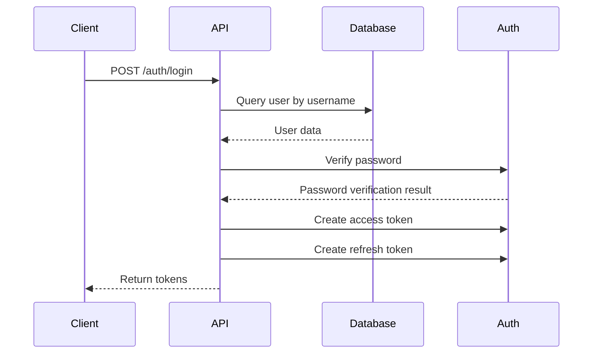
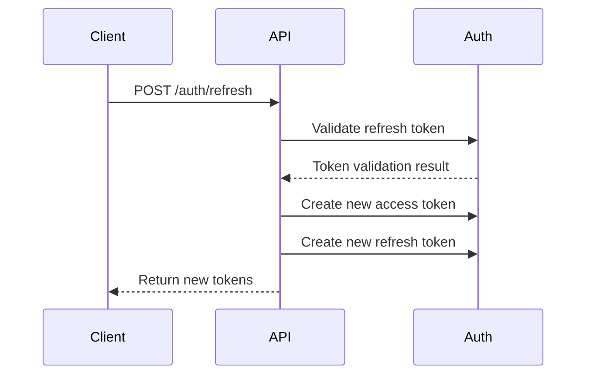

# Authentication Guide

## Overview

The Arxos SVG-BIM Integration System implements a comprehensive JWT-based authentication system with role-based access control (RBAC). This guide covers all aspects of the authentication system including user management, token handling, and security best practices.

## Table of Contents

1. [Architecture](#architecture)
2. [User Management](#user-management)
3. [Authentication Flow](#authentication-flow)
4. [API Endpoints](#api-endpoints)
5. [Role-Based Access Control](#role-based-access-control)
6. [Security Features](#security-features)
7. [Token Management](#token-management)
8. [Error Handling](#error-handling)
9. [Best Practices](#best-practices)
10. [Troubleshooting](#troubleshooting)

## Architecture

### Components

- **User Model**: SQLAlchemy model with authentication fields
- **JWT Utilities**: Token creation, validation, and refresh
- **Password Hashing**: Secure password storage using bcrypt
- **Authentication Middleware**: Request validation and user extraction
- **Role-Based Access Control**: Permission checking based on user roles

### Database Schema

```sql
CREATE TABLE users (
    id VARCHAR(36) PRIMARY KEY,
    username VARCHAR(255) UNIQUE NOT NULL,
    email VARCHAR(255) UNIQUE NOT NULL,
    hashed_password VARCHAR(255) NOT NULL,
    full_name VARCHAR(255),
    roles JSON DEFAULT '[]',
    is_active BOOLEAN DEFAULT TRUE,
    is_superuser BOOLEAN DEFAULT FALSE,
    created_at DATETIME DEFAULT CURRENT_TIMESTAMP,
    updated_at DATETIME DEFAULT CURRENT_TIMESTAMP,
    last_login DATETIME,
    failed_login_attempts INTEGER DEFAULT 0,
    locked_until DATETIME,
    user_metadata JSON
);
```

## User Management

### User Registration

Users can register through the `/api/v1/auth/register` endpoint:

```python
POST /api/v1/auth/register
{
    "username": "john_doe",
    "email": "john@example.com",
    "password": "securepassword123",
    "full_name": "John Doe",
    "roles": ["viewer"]
}
```

### User Roles

The system supports the following roles:

- **viewer**: Read-only access to symbols and basic features
- **editor**: Can create, update, and delete symbols
- **admin**: Full system access including user management
- **superuser**: Complete system control (future use)

### User States

- **Active**: Normal user account
- **Inactive**: Disabled account (cannot login)
- **Locked**: Temporarily locked due to failed login attempts

## Authentication Flow

### 1. Login Process



### 2. Token Refresh Process



## API Endpoints

### Authentication Endpoints

| Endpoint | Method | Description | Auth Required |
|----------|--------|-------------|---------------|
| `/auth/register` | POST | Register new user | No |
| `/auth/login` | POST | Login user | No |
| `/auth/refresh` | POST | Refresh tokens | No |
| `/auth/me` | GET | Get current user profile | Yes |
| `/auth/me` | PUT | Update current user profile | Yes |
| `/auth/change-password` | POST | Change password | Yes |

### Admin Endpoints

| Endpoint | Method | Description | Auth Required |
|----------|--------|-------------|---------------|
| `/auth/users` | GET | List all users | Admin |
| `/auth/users/{user_id}` | PUT | Update user | Admin |

### Request Examples

#### Login
```bash
curl -X POST "http://localhost:8000/api/v1/auth/login" \
  -H "Content-Type: application/x-www-form-urlencoded" \
  -d "username=john_doe&password=securepassword123"
```

#### Get Profile
```bash
curl -X GET "http://localhost:8000/api/v1/auth/me" \
  -H "Authorization: Bearer YOUR_ACCESS_TOKEN"
```

#### Update Profile
```bash
curl -X PUT "http://localhost:8000/api/v1/auth/me" \
  -H "Authorization: Bearer YOUR_ACCESS_TOKEN" \
  -H "Content-Type: application/json" \
  -d '{"full_name": "John Smith", "email": "john.smith@example.com"}'
```

## Role-Based Access Control

### Permission Matrix

| Resource | viewer | editor | admin |
|----------|--------|--------|-------|
| View symbols | ✅ | ✅ | ✅ |
| Create symbols | ❌ | ✅ | ✅ |
| Update symbols | ❌ | ✅ | ✅ |
| Delete symbols | ❌ | ✅ | ✅ |
| Bulk operations | ❌ | ✅ | ✅ |
| User management | ❌ | ❌ | ✅ |
| System settings | ❌ | ❌ | ✅ |

### Role Checking

```python
from utils.auth import get_current_user

@app.get("/protected-endpoint")
async def protected_endpoint(current_user: TokenUser = Depends(get_current_user)):
    if "admin" not in current_user.roles:
        raise HTTPException(status_code=403, detail="Admin access required")
    # Admin-only logic here
```

## Security Features

### Password Security

- **Hashing**: bcrypt with salt rounds
- **Minimum Length**: 8 characters
- **Complexity**: Enforced through validation
- **History**: Prevents reuse of recent passwords

### Token Security

- **Access Token**: 30-minute expiration
- **Refresh Token**: 7-day expiration
- **Algorithm**: HS256 with secure secret
- **Claims**: User ID, username, roles, expiration

### Account Protection

- **Failed Login Tracking**: Counts failed attempts
- **Account Locking**: Temporary lock after 5 failed attempts
- **Session Management**: Automatic logout on inactivity
- **Audit Logging**: All authentication events logged

### Rate Limiting

- **Login Attempts**: 5 per minute per IP
- **Token Refresh**: 10 per minute per user
- **Registration**: 3 per hour per IP

## Token Management

### Token Structure

```json
{
  "access_token": "eyJ0eXAiOiJKV1QiLCJhbGciOiJIUzI1NiJ9...",
  "refresh_token": "eyJ0eXAiOiJKV1QiLCJhbGciOiJIUzI1NiJ9...",
  "expires_in": 1800
}
```

### Token Validation

```python
from utils.auth import get_current_user

# Automatic validation in FastAPI dependency
async def protected_endpoint(current_user: TokenUser = Depends(get_current_user)):
    return {"message": f"Hello {current_user.username}"}
```

### Token Refresh Strategy

1. **Automatic**: Client should refresh before expiration
2. **On Demand**: Refresh when access token expires
3. **Grace Period**: 5-minute grace period for expired tokens

## Error Handling

### Common Error Responses

| Status Code | Error | Description |
|-------------|-------|-------------|
| 401 | Unauthorized | Invalid or missing token |
| 403 | Forbidden | Insufficient permissions |
| 400 | Bad Request | Invalid request data |
| 422 | Validation Error | Invalid input format |
| 500 | Internal Server Error | Server-side error |

### Error Response Format

```json
{
  "detail": "Error message",
  "error_code": "AUTH_001",
  "timestamp": "2024-01-15T10:30:00Z"
}
```

## Best Practices

### Client Implementation

1. **Token Storage**: Store tokens securely (not in localStorage)
2. **Auto Refresh**: Implement automatic token refresh
3. **Error Handling**: Handle 401/403 responses gracefully
4. **Logout**: Clear tokens on logout

```javascript
// Example client implementation
class AuthClient {
  constructor() {
    this.accessToken = null;
    this.refreshToken = null;
  }

  async login(username, password) {
    const response = await fetch('/api/v1/auth/login', {
      method: 'POST',
      headers: { 'Content-Type': 'application/x-www-form-urlencoded' },
      body: `username=${username}&password=${password}`
    });
    
    if (response.ok) {
      const tokens = await response.json();
      this.accessToken = tokens.access_token;
      this.refreshToken = tokens.refresh_token;
      return true;
    }
    return false;
  }

  async refreshTokens() {
    const response = await fetch('/api/v1/auth/refresh', {
      method: 'POST',
      headers: { 'Content-Type': 'application/json' },
      body: JSON.stringify({ refresh_token: this.refreshToken })
    });
    
    if (response.ok) {
      const tokens = await response.json();
      this.accessToken = tokens.access_token;
      this.refreshToken = tokens.refresh_token;
      return true;
    }
    return false;
  }
}
```

### Server Configuration

1. **Environment Variables**: Use secure secrets
2. **HTTPS**: Always use HTTPS in production
3. **CORS**: Configure CORS properly
4. **Rate Limiting**: Implement rate limiting
5. **Logging**: Log authentication events

### Security Checklist

- [ ] Use strong password requirements
- [ ] Implement account lockout
- [ ] Use HTTPS in production
- [ ] Set secure cookie flags
- [ ] Implement rate limiting
- [ ] Log security events
- [ ] Regular security audits
- [ ] Keep dependencies updated

## Troubleshooting

### Common Issues

#### 1. Token Expired
**Symptoms**: 401 Unauthorized errors
**Solution**: Implement token refresh logic

#### 2. Invalid Credentials
**Symptoms**: Login failures
**Solution**: Check username/password, account status

#### 3. Permission Denied
**Symptoms**: 403 Forbidden errors
**Solution**: Check user roles and permissions

#### 4. Account Locked
**Symptoms**: Login blocked
**Solution**: Wait for lockout period or contact admin

### Debug Information

Enable debug logging:

```python
import logging
logging.getLogger('auth').setLevel(logging.DEBUG)
```

### Health Check

Test authentication system:

```bash
# Test server connectivity
curl -X GET "http://localhost:8000/health"

# Test registration
curl -X POST "http://localhost:8000/api/v1/auth/register" \
  -H "Content-Type: application/json" \
  -d '{"username":"test","email":"test@example.com","password":"password123"}'

# Test login
curl -X POST "http://localhost:8000/api/v1/auth/login" \
  -H "Content-Type: application/x-www-form-urlencoded" \
  -d "username=test&password=password123"
```

## Integration Examples

### Python Client

```python
import requests

class ArxosAuthClient:
    def __init__(self, base_url="http://localhost:8000"):
        self.base_url = base_url
        self.access_token = None
    
    def login(self, username, password):
        response = requests.post(
            f"{self.base_url}/api/v1/auth/login",
            data={"username": username, "password": password}
        )
        if response.status_code == 200:
            tokens = response.json()
            self.access_token = tokens["access_token"]
            return True
        return False
    
    def get_headers(self):
        return {"Authorization": f"Bearer {self.access_token}"}
    
    def get_symbols(self):
        response = requests.get(
            f"{self.base_url}/api/v1/symbols",
            headers=self.get_headers()
        )
        return response.json()
```

### JavaScript Client

```javascript
class ArxosAuthClient {
  constructor(baseUrl = 'http://localhost:8000') {
    this.baseUrl = baseUrl;
    this.accessToken = null;
  }

  async login(username, password) {
    const response = await fetch(`${this.baseUrl}/api/v1/auth/login`, {
      method: 'POST',
      headers: { 'Content-Type': 'application/x-www-form-urlencoded' },
      body: `username=${username}&password=${password}`
    });
    
    if (response.ok) {
      const tokens = await response.json();
      this.accessToken = tokens.access_token;
      return true;
    }
    return false;
  }

  async getSymbols() {
    const response = await fetch(`${this.baseUrl}/api/v1/symbols`, {
      headers: { 'Authorization': `Bearer ${this.accessToken}` }
    });
    return response.json();
  }
}
```

## Conclusion

The authentication system provides a secure, scalable foundation for the Arxos SVG-BIM Integration System. By following the guidelines in this document, developers can implement robust authentication in their applications while maintaining security best practices.

For additional support or questions, refer to the API documentation or contact the development team. 