# BIM Assembly Pipeline Diagrams

## Overview
This document contains Mermaid diagrams showing the BIM assembly pipeline and data flow for the Arxos SVG-BIM system.

## 1. High-Level Pipeline Flow

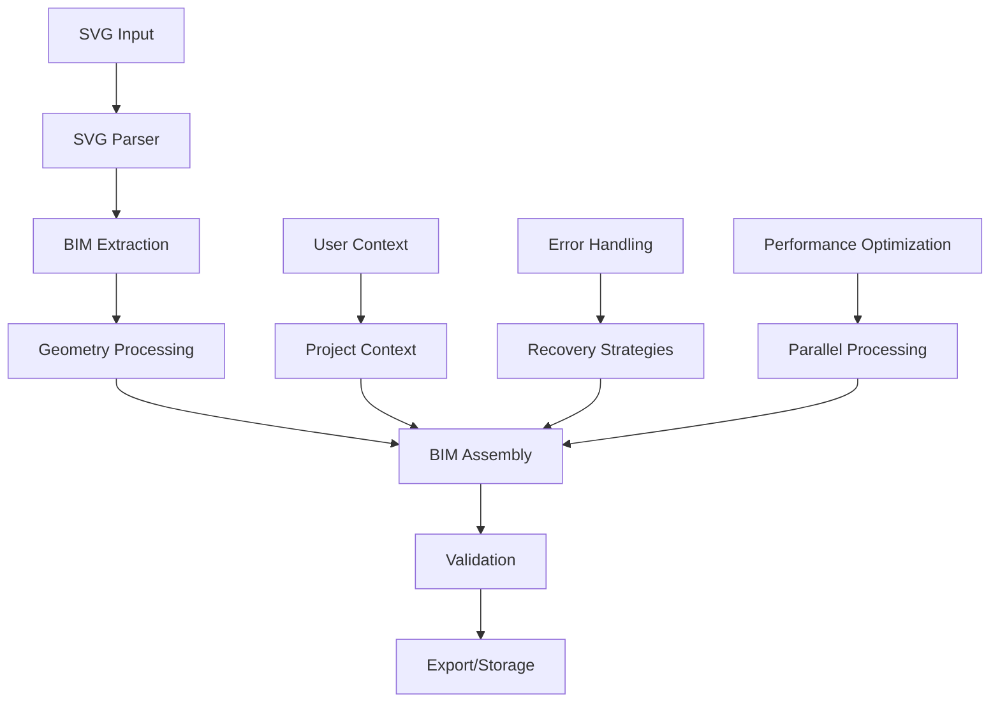

## 2. Detailed BIM Assembly Pipeline

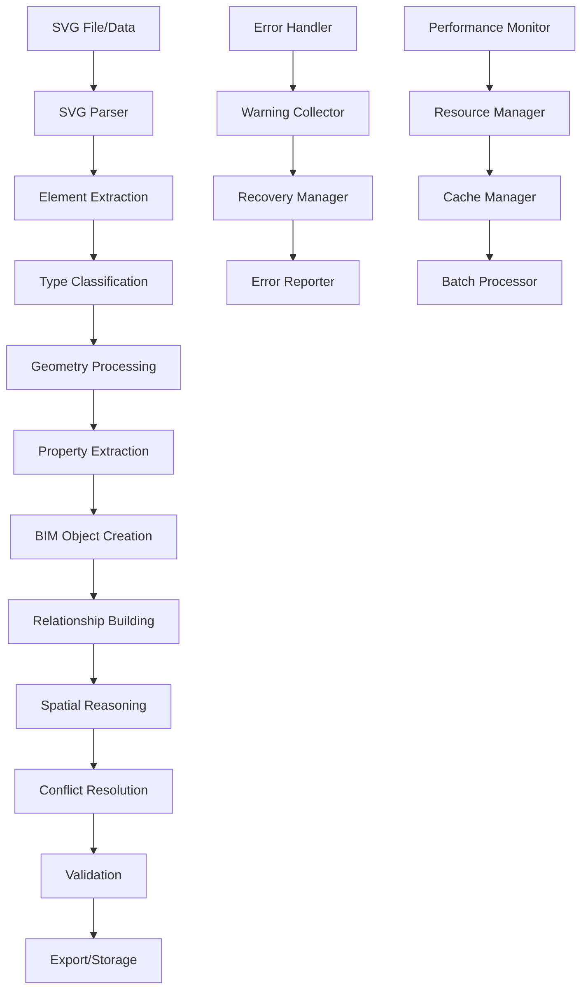

## 3. Data Flow Architecture

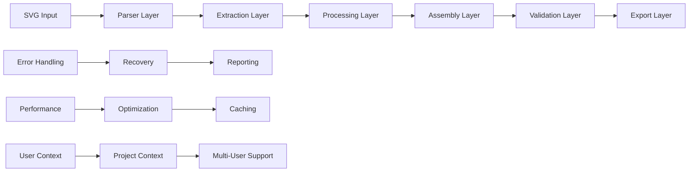

## 4. Component Interaction

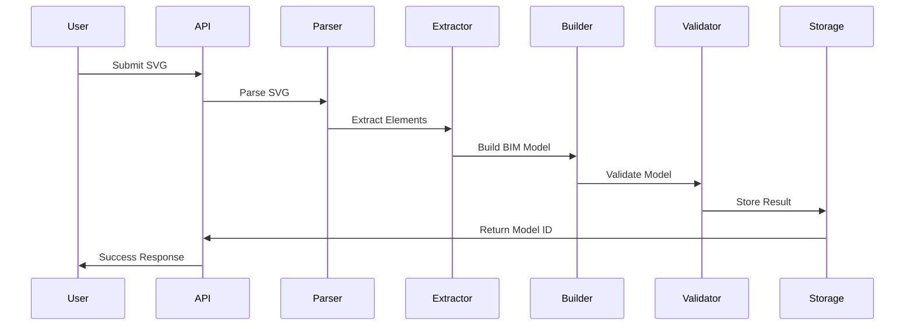

## 5. Error Handling Flow

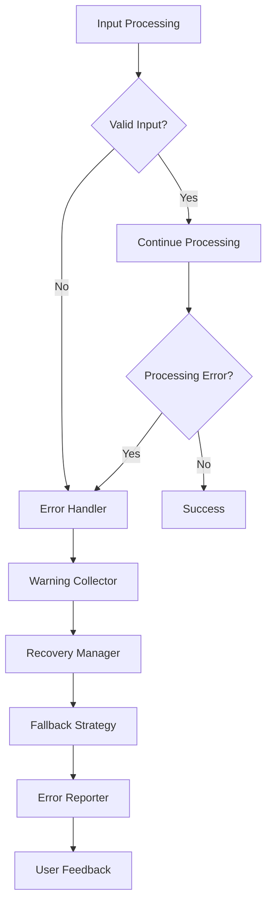

## 6. Performance Optimization Flow

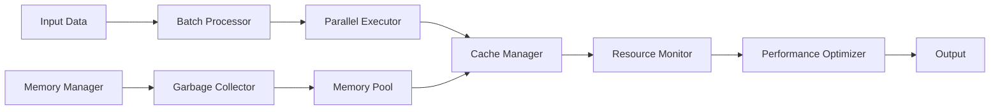

## 7. API Request Flow

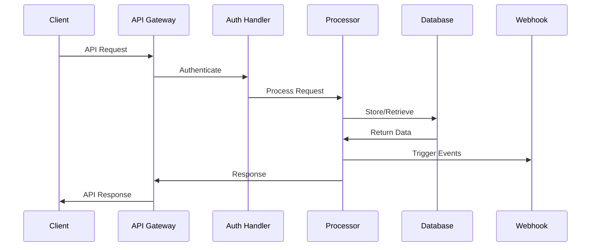

## 8. Multi-User Architecture

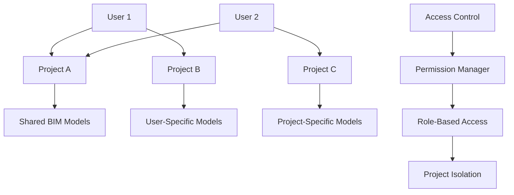

## 9. Export Pipeline

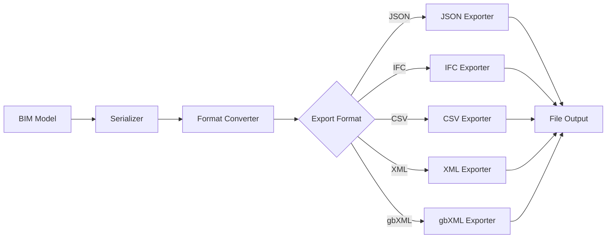

## 10. Database Integration Flow

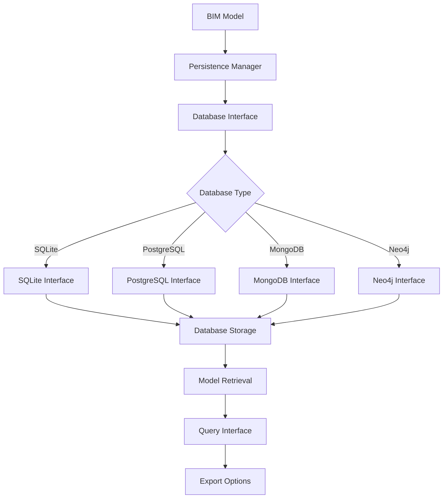

## 11. Webhook Event Flow

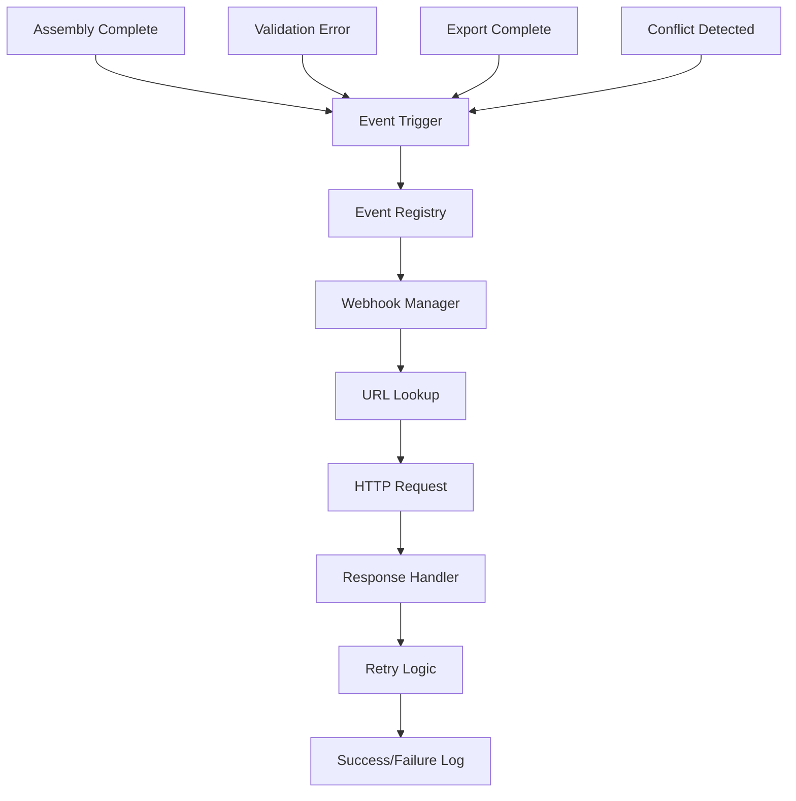

## 12. Testing Architecture

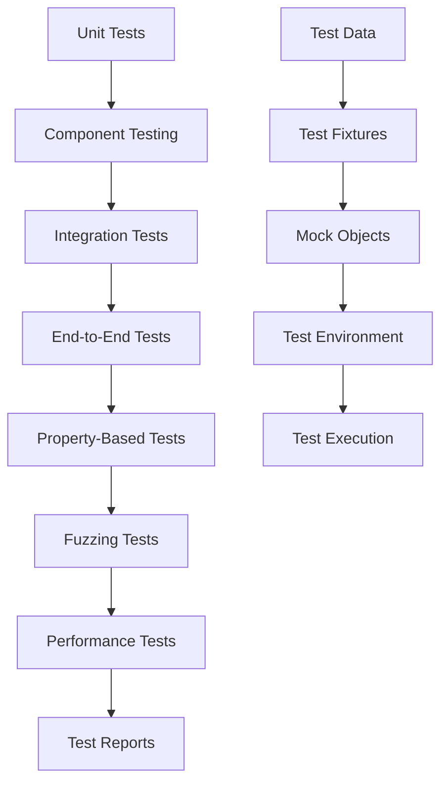

## 13. Development Workflow

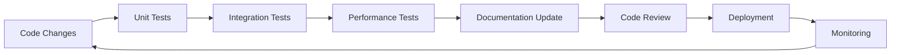

## 14. Error Recovery Strategy

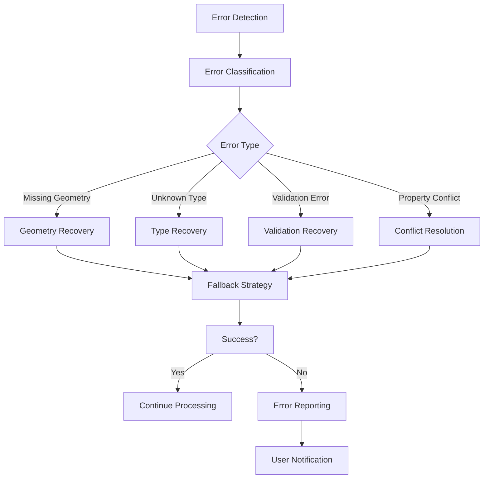

## 15. Performance Monitoring

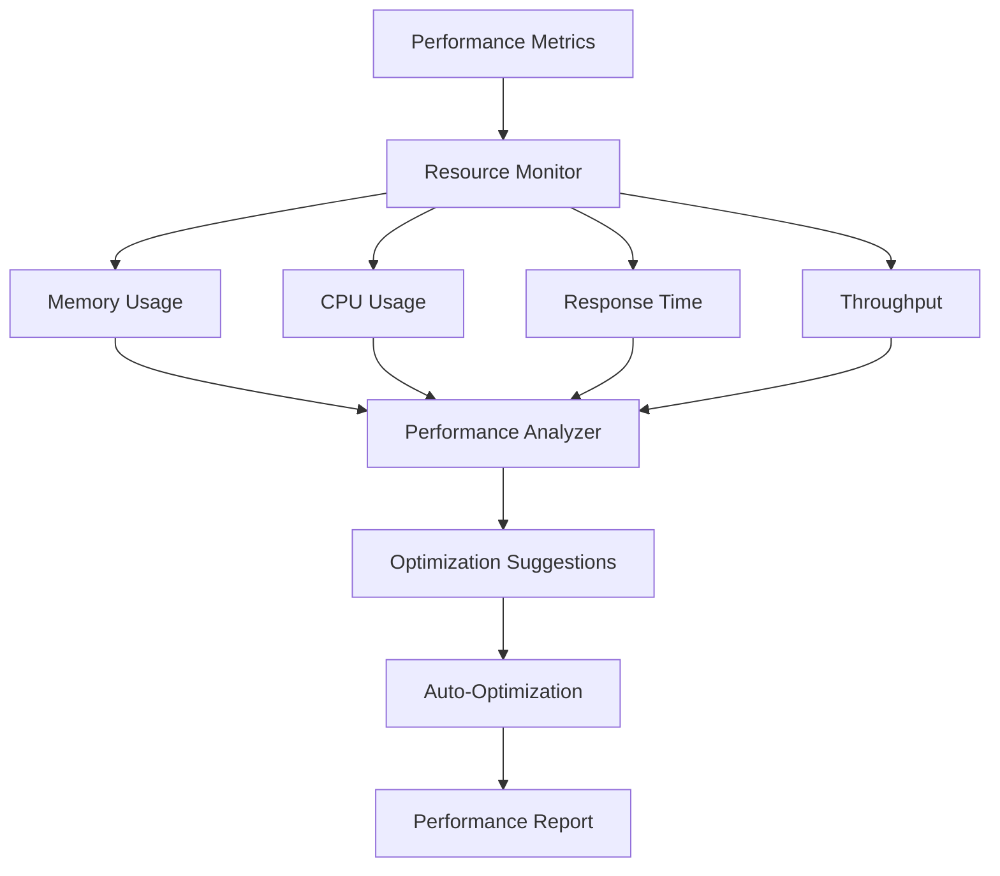

These diagrams provide a comprehensive view of the SVG-BIM system architecture, data flow, and component interactions. They serve as both documentation and development guides for the Arxos project. 