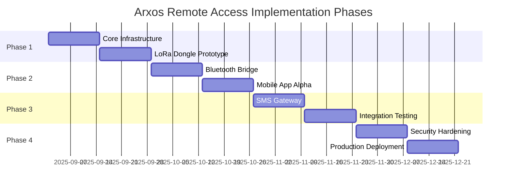

# Arxos Remote Access Implementation Roadmap
**Version:** 1.0  
**Date:** August 31, 2025

## Executive Summary

This roadmap outlines the phased implementation of the Arxos hybrid remote access system, progressing from prototype to production-ready deployment across all three access methods: LoRa dongle, Bluetooth mesh, and SMS gateway.

## Implementation Phases



## Phase 1: Foundation (Weeks 1-4)

### Phase 1: Core Infrastructure

**Deliverables:**
- [ ] Rust core library with FFI bindings
- [ ] Transport abstraction layer
- [ ] Basic ArxQL parser
- [ ] Unit test framework

**Tasks:**
```bash
# Setup development environment
git checkout -b feature/remote-access
cargo new --lib rust-core
cargo add tokio serde bincode

# Core library structure
mkdir -p rust-core/src/{transport,models,protocols,security}

# FFI bindings
cargo add cbindgen
cbindgen --config cbindgen.toml --crate rust-core --output include/arxos.h
```

**Success Criteria:**
- Rust library compiles for iOS and Android targets
- Basic FFI calls work from Swift and Kotlin
- Transport interface defined and mockable

### Week 3-4: LoRa Dongle Prototype

**Deliverables:**
- [ ] PCB design files (KiCad)
- [ ] Firmware skeleton for SAMD21
- [ ] USB serial communication working
- [ ] Basic LoRa packet transmission

**Hardware Tasks:**
```yaml
PCB Design:
  - Create schematic in KiCad
  - Route 4-layer PCB
  - Generate Gerber files
  - Order prototype boards from JLCPCB (5 units)
  
Components:
  - Order from Digikey (see BOM)
  - 3D print enclosure prototype
  - Assemble test units
```

**Firmware Tasks:**
```c
// firmware/dongle/main.c
void setup() {
    // Initialize USB CDC
    usb_init();
    
    // Initialize SX1262
    sx1262_init(915000000, SF7, BW125);
    
    // Initialize crypto
    crypto_init();
}

void loop() {
    // Handle USB commands
    if (usb_available()) {
        process_command();
    }
    
    // Handle LoRa packets
    if (sx1262_available()) {
        process_packet();
    }
}
```

**Testing:**
- [ ] USB enumeration on Windows/Mac/Linux
- [ ] LoRa range test (target: 2km urban)
- [ ] Power consumption measurement
- [ ] Basic encryption working

## Phase 2: Bluetooth & Mobile (Weeks 5-8)

### Week 5-6: Bluetooth Bridge Implementation

**Deliverables:**
- [ ] ESP32 firmware with BLE GATT server
- [ ] Bridge protocol implementation
- [ ] Connection management for 4 simultaneous devices
- [ ] Auto-discovery and pairing

**ESP32 Tasks:**
```cpp
// Update existing ESP32 nodes
class BLEBridge {
    void init() {
        // Initialize BLE stack
        ESP_ERROR_CHECK(esp_ble_gatts_register_callback(gatts_event_handler));
        ESP_ERROR_CHECK(esp_ble_gatts_app_register(PROFILE_APP_ID));
        
        // Start advertising
        start_advertising();
    }
    
    void bridge_task(void* param) {
        while(1) {
            // Bridge BLE ↔ LoRa
            handle_ble_to_lora();
            handle_lora_to_ble();
            vTaskDelay(10);
        }
    }
};
```

**Testing Protocol:**
```bash
# BLE Testing
./test_ble_connection.sh
./test_ble_throughput.sh
./test_ble_range.sh
./test_ble_security.sh
```

### Week 7-8: Mobile App Alpha

**Deliverables:**
- [ ] iOS app with basic UI
- [ ] Android app with basic UI
- [ ] LoRa dongle support
- [ ] Bluetooth connection working

**iOS Development:**
```swift
// iOS minimum viable product
struct ArxosApp: App {
    var body: some Scene {
        WindowGroup {
            TabView {
                TerminalView()
                    .tabItem { Label("Terminal", systemImage: "terminal") }
                
                BuildingMapView()
                    .tabItem { Label("Map", systemImage: "map") }
                
                ConnectionView()
                    .tabItem { Label("Connect", systemImage: "antenna.radiowaves.left.and.right") }
            }
        }
    }
}
```

**Android Development:**
```kotlin
// Android minimum viable product
@Composable
fun ArxosApp() {
    val navController = rememberNavController()
    
    Scaffold(
        bottomBar = { BottomNavigationBar(navController) }
    ) { innerPadding ->
        NavHost(
            navController = navController,
            startDestination = "terminal"
        ) {
            composable("terminal") { TerminalScreen() }
            composable("map") { BuildingMapScreen() }
            composable("connect") { ConnectionScreen() }
        }
    }
}
```

**App Store Preparation:**
- [ ] Apple Developer account setup
- [ ] Google Play Console account
- [ ] App icons and screenshots
- [ ] Privacy policy and terms

## Phase 3: SMS Gateway & Integration (Weeks 9-12)

### Week 9-10: SMS Gateway Implementation

**Deliverables:**
- [ ] Raspberry Pi setup script
- [ ] Cellular modem configuration
- [ ] SMS parser and responder
- [ ] Emergency command set

**Gateway Setup:**
```bash
#!/bin/bash
# setup_sms_gateway.sh

# Install dependencies
sudo apt-get update
sudo apt-get install -y python3-pip minicom
pip3 install pyserial smspdudecoder

# Configure modem
sudo minicom -s /dev/ttyUSB0

# Install service
sudo cp arxos-sms-gateway.service /etc/systemd/system/
sudo systemctl enable arxos-sms-gateway
sudo systemctl start arxos-sms-gateway
```

**Command Implementation:**
```python
# SMS command handlers
class CommandHandler:
    def handle_status(self, params):
        room = params.get('room')
        result = self.mesh.query(f"room:{room}")
        return self.format_status(result)
    
    def handle_emergency_exits(self):
        exits = self.mesh.query("type:emergency_exit")
        return self.format_exits(exits)
    
    def handle_map(self, params):
        floor = params.get('floor', 1)
        plan = self.mesh.get_floor_plan(floor)
        return self.compress_for_sms(plan)
```

### Week 11-12: System Integration

**Deliverables:**
- [ ] All three transport methods working together
- [ ] Automatic failover between methods
- [ ] Unified mobile app experience
- [ ] End-to-end testing complete

**Integration Tests:**
```python
# test_integration.py
class IntegrationTests:
    def test_automatic_failover(self):
        # Start with LoRa
        assert connect_lora() == True
        
        # Disconnect LoRa
        disconnect_lora()
        
        # Should failover to Bluetooth
        assert get_active_transport() == "Bluetooth"
        
        # Disconnect Bluetooth
        disconnect_bluetooth()
        
        # Should failover to SMS
        assert get_active_transport() == "SMS"
    
    def test_concurrent_connections(self):
        # Multiple devices connecting simultaneously
        devices = []
        for i in range(10):
            device = create_test_device(f"device_{i}")
            devices.append(device)
            assert device.connect() == True
        
        # All should maintain connection
        for device in devices:
            assert device.is_connected() == True
```

**Performance Benchmarks:**
| Metric | Target | Test Method |
|--------|--------|-------------|
| LoRa latency | <500ms | Round-trip ping |
| BLE throughput | >50kbps | Bulk transfer test |
| SMS response | <30s | Command-response time |
| Battery life | >8 hours | Continuous use test |

## Phase 4: Production Ready (Weeks 13-16)

### Week 13-14: Security Hardening

**Deliverables:**
- [ ] Security audit complete
- [ ] Penetration testing performed
- [ ] Encryption verified end-to-end
- [ ] Emergency override tested

**Security Checklist:**
```yaml
Authentication:
  ✓ Ed25519 key generation
  ✓ Challenge-response protocol
  ✓ Session key rotation
  ✓ Emergency codes working

Encryption:
  ✓ AES-128 for LoRa
  ✓ BLE encryption enabled
  ✓ Key storage secure
  ✓ Perfect forward secrecy

Access Control:
  ✓ RBAC implemented
  ✓ Audit logging active
  ✓ Rate limiting enforced
  ✓ Intrusion detection online
```

**Penetration Testing:**
```bash
# RF Security Testing
./test_jamming_resistance.sh
./test_replay_attack.sh
./test_eavesdropping.sh

# Application Security
./test_authentication_bypass.sh
./test_privilege_escalation.sh
./test_data_leakage.sh
```

### Week 15-16: Production Deployment

**Deliverables:**
- [ ] Production hardware manufactured
- [ ] Mobile apps in app stores
- [ ] Documentation complete
- [ ] Support system ready

**Manufacturing:**
```yaml
LoRa Dongles:
  - Order 100 units from assembly house
  - Program and test each unit
  - Package with documentation
  - Setup fulfillment process

SMS Gateways:
  - Configure 10 Raspberry Pi units
  - Install cellular modems
  - Pre-configure for buildings
  - Create deployment kit
```

**App Store Launch:**
```yaml
iOS App Store:
  - Submit for review
  - Address review feedback
  - Phased rollout (10% → 50% → 100%)
  - Monitor crash reports

Google Play:
  - Upload signed APK
  - Complete store listing
  - Setup beta testing channel
  - Monitor user feedback
```

## Resource Requirements

### Team Structure

| Role | Hours/Week | Duration | Responsibilities |
|------|------------|----------|------------------|
| Lead Developer | 40 | 16 weeks | Architecture, Rust core, integration |
| Hardware Engineer | 30 | 8 weeks | LoRa dongle, gateway setup |
| Mobile Developer | 40 | 12 weeks | iOS and Android apps |
| Security Engineer | 20 | 6 weeks | Security audit, penetration testing |
| QA Tester | 30 | 8 weeks | Testing, documentation |

### Budget Estimate

| Category | Cost | Notes |
|----------|------|-------|
| **Hardware Development** | | |
| PCB prototypes | $500 | 3 iterations |
| Components | $2,000 | 100 dongles worth |
| Assembly | $3,000 | 100 units |
| Test equipment | $1,500 | Spectrum analyzer rental |
| **Software Development** | | |
| Developer accounts | $300 | Apple + Google |
| Cloud services | $500 | CI/CD, testing |
| Code signing cert | $500 | EV certificate |
| **Testing & Certification** | | |
| FCC testing | $5,000 | Pre-cert testing |
| Security audit | $10,000 | External firm |
| Beta testing | $2,000 | User incentives |
| **Manufacturing** | | |
| Tooling | $3,000 | Enclosure molds |
| Initial inventory | $10,000 | 500 units |
| **Total** | **$38,300** | |

### Risk Mitigation

| Risk | Probability | Impact | Mitigation |
|------|-------------|--------|------------|
| FCC certification delay | Medium | High | Start early, use pre-certified modules |
| App store rejection | Low | Medium | Follow guidelines strictly, have backup |
| Hardware supply chain | Medium | High | Order extra components, multiple suppliers |
| Security vulnerability | Low | High | Multiple audits, bug bounty program |
| User adoption | Medium | Medium | Beta program, clear documentation |

## Success Metrics

### Technical KPIs
- [ ] 99.9% uptime for gateway services
- [ ] <1% packet loss on LoRa network
- [ ] <500ms query response time
- [ ] Zero security breaches

### Business KPIs
- [ ] 100 buildings connected in first year
- [ ] 1,000 active users
- [ ] 90% user satisfaction score
- [ ] <$50 deployment cost per building

### Quality Gates

**Alpha Release (Week 8):**
- Core functionality working
- Basic security implemented
- Internal testing complete

**Beta Release (Week 12):**
- All features implemented
- Security audit passed
- External beta testing started

**Production Release (Week 16):**
- All tests passing
- Documentation complete
- Support system operational
- Manufacturing ready

## Maintenance Plan

### Post-Launch Support

**Week 17-20: Stabilization**
- Monitor production metrics
- Fix critical bugs
- Gather user feedback
- Plan v2.0 features

**Ongoing Maintenance:**
- Security updates monthly
- Feature updates quarterly
- Hardware revisions annually
- 24/7 emergency support for gateways

### Version 2.0 Roadmap

**Planned Features:**
- Voice control integration
- Apple Watch / WearOS apps
- LoRaWAN compatibility
- Multi-building management
- Advanced analytics
- API for third-party integration

## Conclusion

This implementation roadmap provides a clear path from concept to production for the Arxos hybrid remote access system. By following this phased approach, we can deliver a robust, secure, and user-friendly solution that maintains the air-gapped security model while providing practical remote building access.

The 16-week timeline is aggressive but achievable with dedicated resources. Key to success will be parallel development of hardware and software components, early and continuous testing, and maintaining focus on the core value proposition: secure, offline building intelligence access.

## Appendix: Quick Start Commands

```bash
# Clone repository
git clone arxos-remote-access
cd arxos-remote-access

# Setup development environment
./scripts/setup_dev_env.sh

# Build all components
make all

# Run tests
make test

# Deploy to test environment
./scripts/deploy_test.sh

# Monitor production
./scripts/monitor_production.sh
```

---

**Document Version:** 1.0  
**Last Updated:** August 31, 2025  
**Next Review:** September 15, 2025