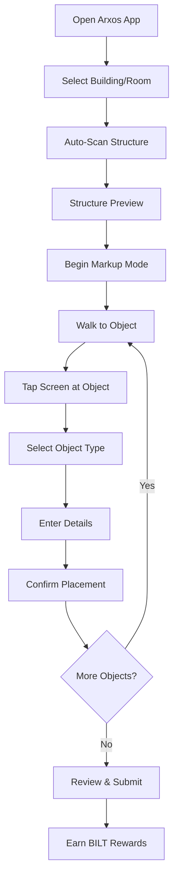

# AR Interface: Snapchat for Buildings

## Making Technical Markup Feel Like Social Media

The Arxos AR interface revolutionizes how field workers interact with building data by using familiar social media patterns. Workers tap to mark objects just like tagging locations in Snapchat, making professional building intelligence accessible to anyone with a smartphone.

### 📖 Section Contents

1. **[Interface Design](interface-design.md)** - UI/UX patterns and components
2. **[AR Markup Flow](markup-flow.md)** - Step-by-step marking process
3. **[LiDAR Integration](lidar-integration.md)** - Structure capture with RoomPlan
4. **[Verification System](verification.md)** - Quality assurance mechanics
5. **[Implementation Guide](implementation.md)** - iOS development details

## 🎯 The Interface Philosophy

### Why "Snapchat for Buildings"?

**Traditional Technical Interface:**
- Complex forms with 50+ fields
- Technical jargon everywhere
- Hours of training required
- High error rates
- Low user engagement

**Arxos Social Media Approach:**
- Tap to mark (like Snapchat location tags)
- Visual icons instead of text
- 5-minute learning curve
- Natural interaction patterns
- High engagement through gamification

## 🏗️ The Two-Phase Process

### Phase 1: Automatic Structure Capture (20 seconds)

```swift
// User simply walks through room
class StructureCapture {
    let roomCaptureSession = RoomCaptureSession()
    
    func startCapture() {
        roomCaptureSession.run(configuration: .default)
        // LiDAR automatically detects:
        // - Walls, floors, ceilings
        // - Doors and windows
        // - Room dimensions
        // - Basic geometry
    }
    
    func processCapture() -> StructuralData {
        // Convert to ArxObjects
        let walls = detectPlanes(from: pointCloud)
        let openings = detectOpenings(from: walls)
        return StructuralData(walls: walls, openings: openings)
    }
}
```

**What Gets Captured Automatically:**
- Room boundaries and dimensions
- Door and window locations
- Floor and ceiling planes
- Basic structural elements

### Phase 2: Human Markup (2-3 minutes)

```swift
// Worker taps to add technical details
class ARMarkupInterface {
    func handleTap(at screenPoint: CGPoint) {
        // 1. Ray cast to find 3D position
        let worldPosition = raycast(from: screenPoint)
        
        // 2. Show Snapchat-style selection menu
        showObjectTypeMenu(at: worldPosition)
    }
    
    func showObjectTypeMenu(at position: Vector3) {
        let menu = ARMenu(
            options: [
                ARMenuOption(icon: "🔌", label: "Outlet", 
                           action: { self.markOutlet(at: position) }),
                ARMenuOption(icon: "💡", label: "Light",
                           action: { self.markLight(at: position) }),
                ARMenuOption(icon: "🚪", label: "Emergency Exit",
                           action: { self.markEmergencyExit(at: position) }),
                ARMenuOption(icon: "🌡️", label: "HVAC",
                           action: { self.markHVAC(at: position) }),
                ARMenuOption(icon: "🔥", label: "Fire Safety",
                           action: { self.markFireSafety(at: position) })
            ]
        )
        presentMenu(menu, at: position)
    }
}
```

## 💡 Interface Components

### Visual Selection Menu
```
┌─────────────────────────────────┐
│      What's at this location?   │
├─────────────────────────────────┤
│  🔌 Electrical Outlet           │
│  💡 Light Fixture               │
│  🚪 Emergency Exit              │
│  🌡️ HVAC Component              │
│  🔥 Fire Safety Equipment       │
│  🚰 Plumbing Fixture            │
│  📡 Network/Data Port           │
│  🎛️ Control Panel               │
└─────────────────────────────────┘
```

### Quick Detail Entry
```
┌─────────────────────────────────┐
│    🔌 Electrical Outlet Details │
├─────────────────────────────────┤
│  Circuit: [A-12___________]     │
│  Voltage: (•) 120V  ( ) 240V    │
│  Amperage: [15A_____▼]          │
│  Type: [GFCI________▼]          │
│                                 │
│  [📸 Photo] [✓ Save] [✗ Cancel] │
└─────────────────────────────────┘
```

### Visual Confirmation
```
✓ Outlet marked successfully!
+10 BILT earned

[View Details] [Add Another] [Done]
```

## 🎮 Gamification Elements

### Immediate Feedback
```swift
struct MarkupFeedback {
    let pointsEarned: Int
    let achievementUnlocked: String?
    let progressUpdate: String
    let leaderboardPosition: Int?
    
    func display() -> ARNotification {
        return ARNotification(
            title: "+\(pointsEarned) BILT",
            subtitle: progressUpdate,
            style: .success,
            duration: 2.0
        )
    }
}
```

### Progress Tracking
```
Room Completion: ████████░░ 80%
Today's BILT: 247 points
Rank: #3 in Maintenance Team
```

### Achievements
```
🏆 "Fire Safety Hero" - Marked all emergency equipment
⚡ "Circuit Master" - Documented 100 electrical components  
🎯 "Accuracy Expert" - 50 verified markups
🚀 "Speed Mapper" - Completed room in under 2 minutes
```

## 📊 User Experience Flow



## 🔧 Technical Implementation

### ARKit Configuration
```swift
class ARSessionManager {
    private let arSession = ARSession()
    private let arConfiguration = ARWorldTrackingConfiguration()
    
    init() {
        // Enable LiDAR if available
        if ARWorldTrackingConfiguration.supportsSceneReconstruction(.mesh) {
            arConfiguration.sceneReconstruction = .mesh
        }
        
        // Enable plane detection
        arConfiguration.planeDetection = [.horizontal, .vertical]
        
        // Enable ray casting
        arConfiguration.frameSemantics = .sceneDepth
    }
    
    func startSession() {
        arSession.run(arConfiguration)
    }
}
```

### Coordinate System Management
```swift
struct CoordinateTransform {
    // Convert screen tap to world position
    static func screenToWorld(
        screenPoint: CGPoint,
        in arView: ARView
    ) -> Vector3? {
        let results = arView.raycast(
            from: screenPoint,
            allowing: .existingPlaneGeometry,
            alignment: .any
        )
        
        guard let firstResult = results.first else { return nil }
        
        return Vector3(
            x: firstResult.worldTransform.columns.3.x,
            y: firstResult.worldTransform.columns.3.y,
            z: firstResult.worldTransform.columns.3.z
        )
    }
    
    // Convert world position to ArxObject coordinates
    static func worldToArxObject(
        worldPosition: Vector3,
        origin: Vector3
    ) -> ArxObjectPosition {
        let relative = worldPosition - origin
        return ArxObjectPosition(
            x: UInt16(relative.x * 1000), // mm precision
            y: UInt16(relative.y * 1000),
            z: UInt16(relative.z * 1000)
        )
    }
}
```

## 🎯 Design Patterns

### 1. Progressive Disclosure
Start simple, reveal complexity only when needed:
```
Tap → Basic Type → Common Details → Advanced (if needed)
```

### 2. Visual Over Textual
Use icons and images instead of text wherever possible:
```
Bad:  "Select emergency exit door type"
Good: 🚪🔴 [Visual door icons to choose from]
```

### 3. Immediate Gratification
Show rewards and progress instantly:
```
Every tap → Points animation
Every 5 objects → Progress notification
Room complete → Achievement celebration
```

### 4. Error Prevention
Make it hard to make mistakes:
```swift
// Smart defaults based on context
if objectType == .outlet {
    suggestCircuit(basedOn: nearbyOutlets)
    defaultVoltage = building.standardVoltage
}

// Validation before submission
if circuit.isEmpty {
    showWarning("Circuit number recommended for outlets")
}
```

## 📱 Responsive Design

### Portrait Mode (Normal Operation)
```
┌─────────────┐
│   Camera    │ 70% - AR view
│    View     │
│             │
├─────────────┤
│   Quick     │ 30% - Controls
│  Actions    │
└─────────────┘
```

### Landscape Mode (Detail Entry)
```
┌─────────────────────────┐
│ Camera │    Detail      │
│  View  │     Form       │
└─────────────────────────┘
   50%         50%
```

## 🔒 Data Validation

### Real-Time Validation
```swift
class MarkupValidator {
    func validate(_ markup: ARMarkup) -> ValidationResult {
        var issues = [ValidationIssue]()
        
        // Check position reasonableness
        if markup.position.z > 4000 { // 4 meters
            issues.append(.warning("Unusually high placement"))
        }
        
        // Check required fields
        if markup.type == .outlet && markup.circuit.isEmpty {
            issues.append(.suggestion("Add circuit number for tracking"))
        }
        
        // Check for duplicates
        if hasNearbyDuplicate(markup) {
            issues.append(.warning("Similar object already marked nearby"))
        }
        
        return ValidationResult(issues: issues)
    }
}
```

## 📈 Success Metrics

### User Engagement
- **Learning Time**: <5 minutes to productive use
- **Markup Speed**: 20-30 objects per room
- **Accuracy Rate**: 95% correct on first attempt
- **Daily Active Users**: 70% of trained workers

### Data Quality
- **Positional Accuracy**: ±5cm
- **Attribute Completeness**: 85% have all recommended fields
- **Verification Rate**: 30% of markups verified by peers
- **Error Rate**: <2% require correction

---

*"Making building intelligence as easy as posting a story"*