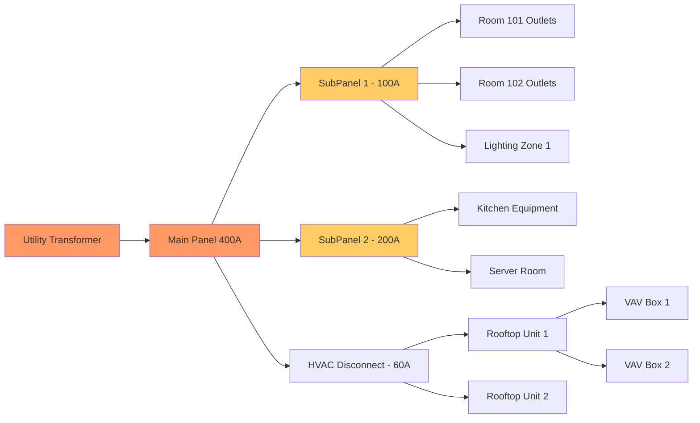

# Arxos Data Model: The ArxObject Architecture

## Core Concept: Everything is an ArxObject

An ArxObject is the atomic unit of building infrastructure. It represents any physical element - from an entire campus to a single screw - with complete identity, location, topology, and lifecycle data.

## The ArxObject Structure

```go
type ArxObject struct {
    // Identity
    ID           uint64              // Unique identifier
    Type         string              // outlet, diffuser, panel, etc.
    Manufacturer string              // Siemens, Carrier, etc.
    Model        string              // Specific model number
    SerialNumber string              // Unique serial
    
    // Location
    X, Y, Z      int32              // Millimeter precision coordinates
    Width        int16              // Physical dimensions
    Height       int16
    Depth        int16
    Rotation     uint16             // Orientation in degrees
    
    // Hierarchy
    ParentID     uint64             // Container object
    ChildIDs     []uint64           // Contained objects
    ScaleMin     int32              // Visibility range
    ScaleMax     int32
    
    // System
    System       string             // electrical, hvac, plumbing, structural
    Subsystem    string             // power, lighting, supply, return, etc.
    
    // Topology (The Gold)
    InputIDs     []uint64           // What feeds this
    OutputIDs    []uint64           // What this feeds
    LoadRating   float32            // Capacity/consumption
    FlowRate     float32            // For fluids/air
    
    // Lifecycle
    InstallDate  time.Time          // When installed
    LastService  time.Time          // Maintenance history
    NextService  time.Time          // Predictive scheduling
    Condition    float32            // 0.0 to 1.0 health score
    
    // Metadata
    Properties   map[string]any     // Flexible attributes
    Tags         []string           // Search/filter tags
    Documents    []DocumentRef      // Manuals, specs, etc.
}
```

## The Fractal Hierarchy

### Scale Levels and Object Types

```
Scale 10^7 - CONTINENTAL
├── PowerGrid
├── TransmissionLine
└── Substation

Scale 10^6 - REGIONAL
├── DistributionNetwork
├── WaterSystem
└── GasNetwork

Scale 10^5 - MUNICIPAL
├── UtilityMain
├── Transformer
└── PumpStation

Scale 10^4 - CAMPUS
├── Building
├── ParkingStructure
├── CentralPlant
└── UtilityVault

Scale 10^3 - BUILDING
├── Floor
├── MechanicalRoom
├── ElectricalRoom
└── Riser

Scale 10^2 - FLOOR
├── Room
├── Corridor
├── Lobby
└── ServiceArea

Scale 10^1 - ROOM
├── Wall
├── Ceiling
├── Door
└── Window

Scale 10^0 - COMPONENT
├── Outlet
├── Switch
├── Diffuser
├── Valve
├── Light
├── Sensor
├── Panel
├── Equipment

Scale 10^-3 - CIRCUIT
├── Breaker
├── Terminal
├── Relay
└── Control

Scale 10^-4 - TRACE
├── Conductor
├── Connector
├── Solder
└── Component
```

## System Planes and Topology

### The Four Primary Systems

```yaml
Electrical:
  Power:
    - Service Entrance → Main Panel
    - Main Panel → Sub Panels
    - Sub Panels → Branch Circuits
    - Branch Circuits → Outlets/Equipment
  
  Lighting:
    - Lighting Panel → Switch Legs
    - Switch Legs → Switches
    - Switches → Fixtures
    - Emergency Circuits → Exit Signs

HVAC:
  Supply:
    - Air Handler → Main Duct
    - Main Duct → Branch Ducts
    - Branch Ducts → VAV Boxes
    - VAV Boxes → Diffusers
  
  Return:
    - Return Grilles → Return Ducts
    - Return Ducts → Air Handler
  
  Refrigerant:
    - Chiller → Cooling Tower
    - Chiller → Air Handlers
    - Split Systems → Indoor Units

Plumbing:
  Supply:
    - Water Main → Meter
    - Meter → Distribution
    - Distribution → Fixtures
    - Hot Water Heater → Hot Lines
  
  Drain:
    - Fixtures → Branch Drains
    - Branch Drains → Stacks
    - Stacks → Building Drain
    - Building Drain → Sewer
  
  Gas:
    - Gas Meter → Distribution
    - Distribution → Equipment

Structural:
  Primary:
    - Foundation → Columns
    - Columns → Beams
    - Beams → Decking
  
  Secondary:
    - Studs → Headers
    - Joists → Subfloor
    - Rafters → Sheathing
```

## The Engineering Systems Index

### Component Data Entry Fields

```typescript
// What users input for each component
interface ComponentEntry {
  // Basic Identity
  type: ComponentType;           // From standardized list
  manufacturer: string;           // Autocomplete from database
  model: string;                  // Exact model number
  serialNumber?: string;          // If available
  
  // Specifications
  electricalRating?: {
    voltage: number;              // 120, 208, 240, 480
    amperage: number;             // Current rating
    phase: '1' | '3';            // Single or three phase
    frequency: number;            // 50 or 60 Hz
  };
  
  hvacRating?: {
    btu: number;                  // Heating/cooling capacity
    cfm: number;                  // Airflow rate
    seer?: number;                // Efficiency rating
    refrigerant?: string;         // R410A, R134a, etc.
  };
  
  plumbingRating?: {
    gpm: number;                  // Flow rate
    psi: number;                  // Pressure rating
    size: string;                 // Pipe diameter
  };
  
  // Topology - THE MOST VALUABLE DATA
  feeds: {
    fromPanel?: string;           // Electrical source
    fromCircuit?: number;         // Circuit number
    fromEquipment?: string;       // Upstream equipment ID
  };
  
  supplies: {
    equipment?: string[];         // What this powers/feeds
    rooms?: string[];            // Areas served
  };
  
  // Maintenance
  installDate: Date;
  warrantyExpires?: Date;
  lastService?: Date;
  serviceInterval?: number;      // Days between service
  
  // Documentation
  manualUrl?: string;
  photoUrl?: string;
  notes?: string;
}
```

### Example: Complete Electrical Panel Entry

```json
{
  "type": "electrical_panel",
  "manufacturer": "Square D",
  "model": "QO142M200PC",
  "serialNumber": "31-2847659",
  
  "electricalRating": {
    "voltage": 240,
    "amperage": 200,
    "phase": "1",
    "frequency": 60
  },
  
  "feeds": {
    "fromEquipment": "main-service-panel",
    "fromCircuit": 1
  },
  
  "supplies": {
    "equipment": [
      "hvac-unit-1",
      "water-heater-1",
      "kitchen-subpanel"
    ],
    "rooms": [
      "floor-2-north",
      "floor-2-south"
    ]
  },
  
  "circuits": [
    {"number": 1, "amperage": 20, "description": "Kitchen Outlets"},
    {"number": 2, "amperage": 20, "description": "Kitchen Outlets"},
    {"number": 3, "amperage": 15, "description": "Lighting - North"},
    {"number": 4, "amperage": 15, "description": "Lighting - South"},
    {"number": 5, "amperage": 30, "description": "Dryer"},
    {"number": 6, "amperage": 50, "description": "Range"},
    // ... up to 42 circuits
  ],
  
  "installDate": "2019-03-15",
  "warrantyExpires": "2029-03-15",
  "lastService": "2024-01-10",
  "serviceInterval": 365,
  
  "manualUrl": "https://download.schneider-electric.com/files?p=Doc_Ref=QO142M200PC",
  "notes": "Main panel for second floor. Fed from 400A main service."
}
```

## The Value of Complete Topology

### Why Topology Makes the Data Valuable

```
Traditional Building Data:
"There's a 5-ton AC unit on the roof"
Value: $0.01

Arxos Topology Data:
"5-ton Carrier 38AUD060 on roof sector 3,
 serial #2419W12345,
 installed 2019-05-15,
 feeds VAV boxes 2-01 through 2-18,
 powered from Panel EP-2 circuits 5-7 (30A 3-phase),
 condensate drains to roof drain RD-3,
 controlled by BAS point AHU-2,
 serviced quarterly by ACME HVAC,
 last service 2024-01-15,
 runtime 18,247 hours,
 efficiency degraded 12% from baseline"
Value: $100
```

### The Connection Graph



## Database Schema

### Core Tables

```sql
-- Main ArxObject storage
CREATE TABLE arx_objects (
    id BIGSERIAL PRIMARY KEY,
    uuid UUID DEFAULT gen_random_uuid(),
    type VARCHAR(50) NOT NULL,
    manufacturer VARCHAR(100),
    model VARCHAR(100),
    serial_number VARCHAR(100),
    
    -- Spatial data
    geom GEOMETRY(POINTZ, 4326) NOT NULL,
    width SMALLINT,
    height SMALLINT,
    depth SMALLINT,
    rotation SMALLINT DEFAULT 0,
    
    -- Hierarchy
    parent_id BIGINT REFERENCES arx_objects(id),
    scale_min INTEGER NOT NULL,
    scale_max INTEGER NOT NULL,
    
    -- System classification
    system VARCHAR(20) NOT NULL,
    subsystem VARCHAR(50),
    
    -- Timestamps
    created_at TIMESTAMP DEFAULT NOW(),
    updated_at TIMESTAMP DEFAULT NOW(),
    installed_at TIMESTAMP,
    
    -- Flexible properties
    properties JSONB DEFAULT '{}',
    
    -- Indexes
    INDEX idx_type (type),
    INDEX idx_system (system),
    INDEX idx_parent (parent_id),
    INDEX idx_scale (scale_min, scale_max),
    INDEX idx_spatial USING GIST (geom)
);

-- Topology connections
CREATE TABLE arx_connections (
    id BIGSERIAL PRIMARY KEY,
    from_id BIGINT REFERENCES arx_objects(id) ON DELETE CASCADE,
    to_id BIGINT REFERENCES arx_objects(id) ON DELETE CASCADE,
    connection_type VARCHAR(50) NOT NULL, -- 'power', 'data', 'fluid', 'air'
    properties JSONB DEFAULT '{}',
    
    UNIQUE(from_id, to_id, connection_type),
    INDEX idx_from (from_id),
    INDEX idx_to (to_id)
);

-- Component specifications
CREATE TABLE arx_specifications (
    id BIGSERIAL PRIMARY KEY,
    object_id BIGINT REFERENCES arx_objects(id) ON DELETE CASCADE,
    spec_type VARCHAR(50) NOT NULL,
    spec_value JSONB NOT NULL,
    
    INDEX idx_object_spec (object_id, spec_type)
);

-- Maintenance history
CREATE TABLE arx_maintenance (
    id BIGSERIAL PRIMARY KEY,
    object_id BIGINT REFERENCES arx_objects(id) ON DELETE CASCADE,
    service_date TIMESTAMP NOT NULL,
    service_type VARCHAR(50),
    technician VARCHAR(100),
    notes TEXT,
    next_service TIMESTAMP,
    
    INDEX idx_object_maintenance (object_id),
    INDEX idx_next_service (next_service)
);
```

### Efficient Topology Queries

```sql
-- Find everything downstream from a circuit breaker
WITH RECURSIVE downstream AS (
    SELECT id, type, properties
    FROM arx_objects
    WHERE id = $1
    
    UNION ALL
    
    SELECT o.id, o.type, o.properties
    FROM arx_objects o
    JOIN arx_connections c ON c.from_id = downstream.id
    WHERE c.to_id = o.id
)
SELECT * FROM downstream;

-- Find all equipment in a room with their power sources
SELECT 
    o.id,
    o.type,
    o.manufacturer,
    o.model,
    power_source.model as powered_by,
    c.properties->>'circuit' as circuit_number
FROM arx_objects o
LEFT JOIN arx_connections c ON c.to_id = o.id AND c.connection_type = 'power'
LEFT JOIN arx_objects power_source ON power_source.id = c.from_id
WHERE ST_Contains(
    (SELECT geom FROM arx_objects WHERE type = 'room' AND properties->>'number' = '101'),
    o.geom
);

-- Calculate total electrical load on a panel
SELECT 
    panel.id,
    panel.model,
    SUM((downstream.properties->>'amperage')::float) as total_load,
    (panel.properties->>'rating')::float as panel_rating,
    (SUM((downstream.properties->>'amperage')::float) / (panel.properties->>'rating')::float) * 100 as percent_loaded
FROM arx_objects panel
JOIN arx_connections c ON c.from_id = panel.id
JOIN arx_objects downstream ON downstream.id = c.to_id
WHERE panel.type = 'electrical_panel'
GROUP BY panel.id, panel.model, panel.properties;
```

## Data Products from the Model

### 1. Insurance Risk Assessment
```json
{
  "building_id": "bldg-8472",
  "risk_factors": {
    "electrical_age": 15.2,
    "panels_over_80_percent": 3,
    "equipment_past_warranty": 47,
    "overdue_maintenance": 12,
    "recalled_equipment": 2
  },
  "risk_score": 72,
  "annual_claim_probability": 0.18,
  "recommended_premium_adjustment": 1.15
}
```

### 2. Predictive Maintenance
```json
{
  "predictions": [
    {
      "equipment": "RTU-3",
      "failure_probability": 0.78,
      "days_until_failure": 32,
      "failure_mode": "compressor",
      "prevention_cost": 1200,
      "failure_cost": 8500,
      "roi": 7.08
    }
  ]
}
```

### 3. Energy Optimization
```json
{
  "opportunities": [
    {
      "description": "LED retrofit - Floor 3",
      "current_consumption": 18500,
      "projected_consumption": 6200,
      "annual_savings": 14760,
      "implementation_cost": 22000,
      "payback_months": 18
    }
  ]
}
```

## The Network Effect on Data Quality

```
More Users Enter Data
        ↓
Pattern Recognition Improves
        ↓
Auto-Population Gets Smarter
        ↓
Data Entry Gets Faster
        ↓
More Complete Building Graphs
        ↓
Higher Value Analytics
        ↓
More Revenue to Contributors
        ↓
More Users Enter Data
```

## Why This Data Model is Revolutionary

1. **Complete Digital Twin**: Not just geometry, but full operational data
2. **Living Documentation**: Self-updating as equipment is serviced
3. **Topology Intelligence**: Understands cause-and-effect relationships
4. **Fractal Efficiency**: Same structure from continental to component scale
5. **Query Everything**: "Show me all Carrier units installed before 2015 that haven't been serviced in 2 years"

The ArxObject isn't just data storage - it's a complete reimagining of how we think about building infrastructure. Every outlet knows its panel. Every panel knows its load. Every load knows its source. 

**This connected intelligence is what makes Arxos valuable.**