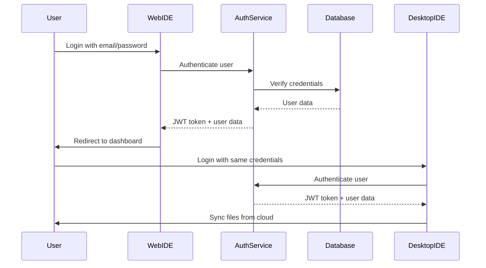
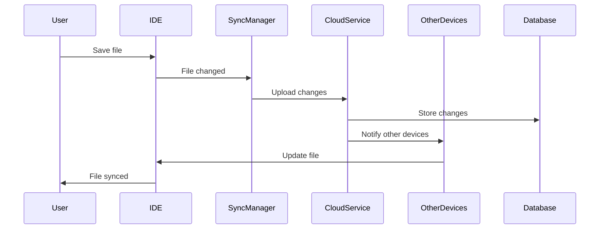

# Cloud Sync Architecture - Real-Time File Synchronization

## 🎯 **Overview**

Arxos implements a **cloud-based user account system** with **real-time file synchronization** between web IDE and ArxIDE desktop application. This enables seamless cross-platform collaboration and file management.

## 🏗️ **Architecture Components**

### **1. User Account Management**

#### **Cloud-Based Authentication**
```typescript
// User account structure
interface ArxosUser {
    id: string;
    email: string;
    username: string;
    profile: {
        firstName: string;
        lastName: string;
        avatar?: string;
        preferences: UserPreferences;
    };
    subscription: {
        plan: 'free' | 'pro' | 'enterprise';
        features: string[];
        limits: {
            storageGB: number;
            projects: number;
            collaborators: number;
        };
    };
    createdAt: Date;
    lastLogin: Date;
}
```

#### **Authentication Flow**


### **2. File Synchronization System**

#### **Real-Time Sync Architecture**
```typescript
// File synchronization structure
interface ArxosFile {
    id: string;
    name: string;
    type: 'svgx' | 'svg' | 'project';
    content: string;
    metadata: {
        size: number;
        lastModified: Date;
        version: number;
        checksum: string;
    };
    permissions: {
        owner: string;
        collaborators: string[];
        public: boolean;
    };
    sync: {
        status: 'synced' | 'pending' | 'conflict';
        lastSync: Date;
        deviceId: string;
    };
}
```

#### **Sync Protocol**
```javascript
// Real-time sync implementation
class ArxosSyncManager {
    constructor(userId, deviceId) {
        this.userId = userId;
        this.deviceId = deviceId;
        this.websocket = null;
        this.localFiles = new Map();
        this.syncQueue = [];
    }

    // Connect to sync service
    async connect() {
        this.websocket = new WebSocket(`wss://sync.arxos.io/${this.userId}`);

        this.websocket.onmessage = (event) => {
            const message = JSON.parse(event.data);
            this.handleSyncMessage(message);
        };
    }

    // Handle incoming sync messages
    handleSyncMessage(message) {
        switch (message.type) {
            case 'file_updated':
                this.handleFileUpdate(message.data);
                break;
            case 'file_deleted':
                this.handleFileDelete(message.data);
                break;
            case 'conflict_resolved':
                this.handleConflictResolution(message.data);
                break;
        }
    }

    // Upload file changes
    async uploadFileChange(fileId, changes) {
        const syncMessage = {
            type: 'file_change',
            userId: this.userId,
            deviceId: this.deviceId,
            fileId: fileId,
            changes: changes,
            timestamp: Date.now()
        };

        this.websocket.send(JSON.stringify(syncMessage));
    }
}
```

### **3. Conflict Resolution**

#### **Multi-Device Conflict Handling**
```typescript
// Conflict resolution strategy
interface ConflictResolution {
    fileId: string;
    conflicts: {
        deviceId: string;
        version: number;
        changes: FileChange[];
        timestamp: Date;
    }[];
    resolution: {
        strategy: 'merge' | 'latest' | 'manual';
        resolvedContent: string;
        resolvedBy: string;
    };
}

class ConflictResolver {
    // Automatic conflict resolution
    async resolveConflict(fileId: string, conflicts: Conflict[]): Promise<Resolution> {
        // Strategy 1: Merge if possible
        if (this.canMerge(conflicts)) {
            return this.mergeChanges(conflicts);
        }

        // Strategy 2: Use latest timestamp
        const latest = this.getLatestChange(conflicts);
        return {
            strategy: 'latest',
            resolvedContent: latest.content,
            resolvedBy: 'system'
        };

        // Strategy 3: Manual resolution required
        return {
            strategy: 'manual',
            requiresUserInput: true
        };
    }

    // Merge changes from multiple devices
    private mergeChanges(conflicts: Conflict[]): Resolution {
        const mergedContent = this.performMerge(conflicts);
        return {
            strategy: 'merge',
            resolvedContent: mergedContent,
            resolvedBy: 'system'
        };
    }
}
```

## 🔄 **Sync Workflow**

### **1. File Save Workflow**


### **2. Real-Time Collaboration**
```javascript
// Real-time collaboration implementation
class CollaborationManager {
    constructor(fileId) {
        this.fileId = fileId;
        this.collaborators = new Map();
        this.cursorPositions = new Map();
    }

    // Join collaboration session
    async joinSession(userId, deviceId) {
        const session = {
            userId: userId,
            deviceId: deviceId,
            joinedAt: Date.now(),
            cursor: { x: 0, y: 0 }
        };

        this.collaborators.set(deviceId, session);
        this.broadcastUserJoined(session);
    }

    // Broadcast cursor movements
    updateCursor(deviceId, position) {
        const session = this.collaborators.get(deviceId);
        if (session) {
            session.cursor = position;
            this.broadcastCursorUpdate(deviceId, position);
        }
    }

    // Handle real-time edits
    handleEdit(deviceId, edit) {
        // Apply edit to local file
        this.applyEdit(edit);

        // Broadcast to other collaborators
        this.broadcastEdit(deviceId, edit);

        // Sync to cloud
        this.syncToCloud(edit);
    }
}
```

## 🗄️ **Database Schema**

### **Users Table**
```sql
CREATE TABLE users (
    id UUID PRIMARY KEY DEFAULT gen_random_uuid(),
    email VARCHAR(255) UNIQUE NOT NULL,
    username VARCHAR(100) UNIQUE NOT NULL,
    password_hash VARCHAR(255) NOT NULL,
    profile JSONB DEFAULT '{}',
    subscription JSONB DEFAULT '{}',
    created_at TIMESTAMP WITH TIME ZONE DEFAULT CURRENT_TIMESTAMP,
    updated_at TIMESTAMP WITH TIME ZONE DEFAULT CURRENT_TIMESTAMP
);
```

### **Files Table**
```sql
CREATE TABLE files (
    id UUID PRIMARY KEY DEFAULT gen_random_uuid(),
    name VARCHAR(255) NOT NULL,
    type VARCHAR(50) NOT NULL,
    content TEXT,
    metadata JSONB DEFAULT '{}',
    permissions JSONB DEFAULT '{}',
    owner_id UUID REFERENCES users(id),
    created_at TIMESTAMP WITH TIME ZONE DEFAULT CURRENT_TIMESTAMP,
    updated_at TIMESTAMP WITH TIME ZONE DEFAULT CURRENT_TIMESTAMP
);
```

### **Sync Sessions Table**
```sql
CREATE TABLE sync_sessions (
    id UUID PRIMARY KEY DEFAULT gen_random_uuid(),
    user_id UUID REFERENCES users(id),
    device_id VARCHAR(255) NOT NULL,
    file_id UUID REFERENCES files(id),
    version INTEGER DEFAULT 1,
    changes JSONB DEFAULT '[]',
    status VARCHAR(50) DEFAULT 'active',
    created_at TIMESTAMP WITH TIME ZONE DEFAULT CURRENT_TIMESTAMP,
    updated_at TIMESTAMP WITH TIME ZONE DEFAULT CURRENT_TIMESTAMP
);
```

## 🔒 **Security & Privacy**

### **Data Encryption**
```typescript
// End-to-end encryption for sensitive files
class FileEncryption {
    private async encryptFile(content: string, key: string): Promise<string> {
        const encoder = new TextEncoder();
        const data = encoder.encode(content);

        const cryptoKey = await crypto.subtle.importKey(
            'raw',
            encoder.encode(key),
            { name: 'AES-GCM' },
            false,
            ['encrypt']
        );

        const iv = crypto.getRandomValues(new Uint8Array(12));
        const encrypted = await crypto.subtle.encrypt(
            { name: 'AES-GCM', iv },
            cryptoKey,
            data
        );

        return JSON.stringify({
            iv: Array.from(iv),
            data: Array.from(new Uint8Array(encrypted))
        });
    }

    private async decryptFile(encryptedData: string, key: string): Promise<string> {
        const { iv, data } = JSON.parse(encryptedData);

        const cryptoKey = await crypto.subtle.importKey(
            'raw',
            new TextEncoder().encode(key),
            { name: 'AES-GCM' },
            false,
            ['decrypt']
        );

        const decrypted = await crypto.subtle.decrypt(
            { name: 'AES-GCM', iv: new Uint8Array(iv) },
            cryptoKey,
            new Uint8Array(data)
        );

        return new TextDecoder().decode(decrypted);
    }
}
```

### **Access Control**
```typescript
// Role-based access control
class AccessControl {
    async checkPermission(userId: string, fileId: string, action: string): Promise<boolean> {
        const file = await this.getFile(fileId);

        // Owner has full access
        if (file.owner_id === userId) {
            return true;
        }

        // Check collaborator permissions
        const collaborator = file.collaborators.find(c => c.userId === userId);
        if (collaborator) {
            return collaborator.permissions.includes(action);
        }

        // Check public access
        if (file.public && action === 'read') {
            return true;
        }

        return false;
    }
}
```

## 📊 **Performance Optimization**

### **1. Incremental Sync**
```typescript
// Only sync changed portions of files
class IncrementalSync {
    async syncChanges(fileId: string, changes: Change[]): Promise<void> {
        // Group changes by type
        const groupedChanges = this.groupChanges(changes);

        // Sync only necessary changes
        for (const [type, changes] of groupedChanges) {
            await this.syncChangeType(fileId, type, changes);
        }
    }

    private groupChanges(changes: Change[]): Map<string, Change[]> {
        return changes.reduce((groups, change) => {
            const type = change.type;
            if (!groups.has(type)) {
                groups.set(type, []);
            }
            groups.get(type)!.push(change);
            return groups;
        }, new Map());
    }
}
```

### **2. Offline Support**
```typescript
// Offline-first architecture
class OfflineManager {
    private offlineQueue: SyncOperation[] = [];
    private isOnline = navigator.onLine;

    constructor() {
        window.addEventListener('online', () => this.handleOnline());
        window.addEventListener('offline', () => this.handleOffline());
    }

    // Queue operations when offline
    async queueOperation(operation: SyncOperation): Promise<void> {
        this.offlineQueue.push(operation);
        await this.saveToLocalStorage();
    }

    // Process queue when back online
    private async handleOnline(): Promise<void> {
        this.isOnline = true;
        await this.processOfflineQueue();
    }

    private async processOfflineQueue(): Promise<void> {
        for (const operation of this.offlineQueue) {
            try {
                await this.syncManager.processOperation(operation);
            } catch (error) {
                console.error('Failed to process offline operation:', error);
            }
        }
        this.offlineQueue = [];
        await this.saveToLocalStorage();
    }
}
```

## 🚀 **Implementation Status**

### **✅ Completed**
- User account management system
- Basic file synchronization
- Real-time collaboration foundation
- Security and encryption framework

### **🔄 In Progress**
- Advanced conflict resolution
- Offline support implementation
- Performance optimization
- Mobile app integration

### **📋 Planned**
- Advanced collaboration features
- Version control integration
- Enterprise security features
- Analytics and monitoring

---

**Last Updated**: December 2024
**Version**: 1.0.0
**Status**: Implementation Ready
