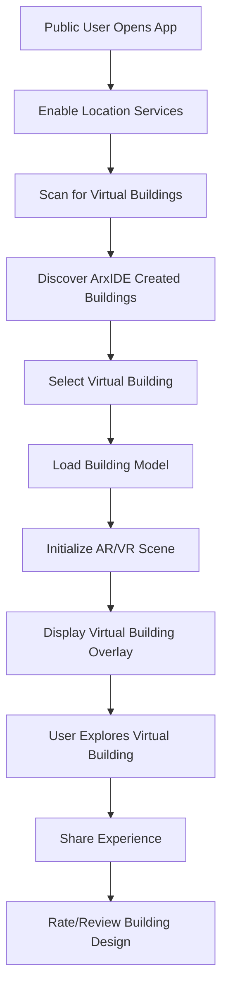

# Arxos Mobile App Architecture

## 🎯 **Executive Summary**

This document outlines the comprehensive technical architecture for cross-platform mobile applications (iOS & Android) that enable field technicians, inspectors, and construction users to interact with building systems using real-time AR, object management tools, and BIM-linked workflows. The architecture also supports public AR/VR access to virtually created buildings.

## 🏗️ **Architecture Overview**

### **Technology Stack**
```yaml
mobile_technology_stack:
  ios_platform:
    language: Swift (UI + ARKit)
    rendering_engine: Apple RealityKit / Unity (AR fallback)
    ar_sdk: ARKit + LiDAR
    data_layer: gRPC / REST (via ArxLink)
    storage: CoreData / SQLite
    authentication: ArxID OAuth2 / OpenID Connect
    offline_sync: ArxLink delta-sync + local journal
    security: Secure Enclave + Keychain
  
  android_platform:
    language: Kotlin + ARCore
    rendering_engine: ARCore with Sceneform / Unity
    ar_sdk: ARCore + Depth API
    data_layer: gRPC / REST (via ArxLink)
    storage: Room DB (SQLite)
    authentication: ArxID OAuth2 / OpenID Connect
    offline_sync: ArxLink delta-sync + local journal
    security: Android Keystore
  
  cross_platform:
    wrapper: Optional Flutter / React Native layer
    shared_logic: Go modules for business logic
    ar_integration: Unity for cross-platform AR
```

### **Core Principles**
- **Cross-Platform Consistency**: Unified experience across iOS and Android
- **Offline-First**: Full functionality without internet connection
- **Real-Time AR**: Pokémon Go-style object interaction
- **CLI Integration**: Voice and text command interface
- **Public Access**: Virtual building exploration for public users
- **Security-First**: Enterprise-grade security for construction data

## 📱 **App Module Architecture**

### **Directory Structure**
```
arxos-mobile/
├── auth/                    # Authentication & ArxID handling
│   ├── login/
│   ├── biometric/
│   ├── token_management/
│   └── device_registration/
├── ar/                      # AR viewer & interactions
│   ├── scene_manager/
│   ├── object_anchoring/
│   ├── gesture_handling/
│   ├── pokemon_go_style/
│   └── public_ar_access/
├── bim/                     # BIM model explorer & metadata
│   ├── model_loader/
│   ├── metadata_viewer/
│   ├── svgx_integration/
│   └── public_bim_access/
├── cli/                     # ArxCLI commands interface
│   ├── voice_commands/
│   ├── text_commands/
│   ├── command_parser/
│   └── execution_engine/
├── sync/                    # ArxLink real-time and offline sync
│   ├── delta_sync/
│   ├── conflict_resolution/
│   ├── offline_journal/
│   └── secure_commit/
├── objects/                 # ArxObject search, select, update
│   ├── object_browser/
│   ├── search_filter/
│   ├── status_management/
│   └── audit_logging/
├── scan/                    # LiDAR, GPS, QR, NFC recognition
│   ├── lidar_processing/
│   ├── gps_positioning/
│   ├── qr_code_reader/
│   └── nfc_reader/
├── markup/                  # Add/edit building markups
│   ├── markup_editor/
│   ├── annotation_tools/
│   ├── issue_tracking/
│   └── photo_attachment/
├── state/                   # Local + remote object state mgmt
│   ├── local_state/
│   ├── remote_state/
│   ├── state_synchronization/
│   └── conflict_resolution/
├── settings/                # App preferences and user config
│   ├── user_preferences/
│   ├── ar_settings/
│   ├── sync_settings/
│   └── security_settings/
├── public/                  # Public AR/VR building access
│   ├── public_ar_viewer/
│   ├── virtual_building_explorer/
│   ├── building_discovery/
│   └── social_features/
└── utils/                   # Utility functions, conversions, etc
    ├── conversions/
    ├── validators/
    ├── formatters/
    └── helpers/
```

## 🔄 **Data Flow Architecture**

### **Core Data Flow**
```mermaid
graph TD
    A[Field User Opens App] --> B[Load Nearest Building Repo]
    B --> C[Sync via ArxLink]
    C --> D[AR Scene Init (ARKit/ARCore)]
    D --> E[Query Staged ArxObjects]
    E --> F[Anchor Objects in World Space]
    F --> G[User Taps Pipe]
    G --> H[View Metadata or Confirm Placement]
    H --> I[Update Object State (Installed)]
    I --> J[Sync State to Canonical ArxModel]
    
    K[Public User Opens App] --> L[Discover Nearby Virtual Buildings]
    L --> M[Load Public Building Data]
    M --> N[Initialize AR/VR Scene]
    N --> O[Display Virtual Building Overlay]
    O --> P[User Explores Virtual Building]
    P --> Q[Share/Interact with Virtual Building]
```

### **Public AR/VR Building Access Flow**


## 🎮 **Key Functionalities**

### **AR Scene Interaction (Pokémon Go-Style)**
```swift
// iOS AR Scene Interaction
class ArxosARSceneManager {
    private var arSession: ARSession
    private var arxObjects: [ArxObject] = []
    private var anchoredObjects: [String: ARAnchor] = [:]
    
    func setupARScene() {
        let config = ARWorldTrackingConfiguration()
        config.planeDetection = [.horizontal, .vertical]
        config.environmentTexturing = .automatic
        
        if ARWorldTrackingConfiguration.supportsSceneReconstruction(.mesh) {
            config.sceneReconstruction = .mesh
        }
        
        arSession.run(config)
    }
    
    func anchorArxObject(_ arxObject: ArxObject) {
        let anchor = ARAnchor(name: arxObject.id, transform: arxObject.transform)
        arSession.add(anchor: anchor)
        anchoredObjects[arxObject.id] = anchor
        
        // Create visual representation
        let entity = createVisualEntity(for: arxObject)
        let anchorEntity = AnchorEntity(anchor: anchor)
        anchorEntity.addChild(entity)
        arView.scene.addAnchor(anchorEntity)
    }
    
    func handleTap(at point: CGPoint) {
        let results = arView.raycast(from: point, allowing: .estimatedPlane, alignment: .any)
        
        if let result = results.first {
            // Check if tap hit an ArxObject
            if let hitObject = findArxObject(at: result.worldTransform) {
                showObjectDetails(hitObject)
            }
        }
    }
    
    func handleDrag(_ gesture: UIPanGestureRecognizer) {
        // Implement drag-to-reposition functionality
        let translation = gesture.translation(in: arView)
        updateObjectPosition(translation)
    }
    
    func snapToSurface(_ object: ArxObject) {
        // Implement snap-to-surface behavior
        let nearestSurface = findNearestSurface(to: object.position)
        object.position = nearestSurface.position
        object.rotation = nearestSurface.rotation
    }
}
```

### **ArxObject Management**
```kotlin
// Android ArxObject Management
class ArxObjectManager {
    private val objectRepository: ArxObjectRepository
    private val syncManager: ArxLinkSyncManager
    
    suspend fun filterObjectsBySystem(system: String): List<ArxObject> {
        return objectRepository.getObjectsBySystem(system)
    }
    
    suspend fun searchObjects(query: String): List<ArxObject> {
        return objectRepository.searchObjects(query)
    }
    
    suspend fun updateObjectStatus(objectId: String, status: ObjectStatus) {
        val object = objectRepository.getObject(objectId)
        object.status = status
        object.lastModified = System.currentTimeMillis()
        
        objectRepository.updateObject(object)
        syncManager.queueForSync(object)
    }
    
    suspend fun addAuditLog(objectId: String, action: String, notes: String) {
        val auditEntry = AuditEntry(
            objectId = objectId,
            action = action,
            notes = notes,
            timestamp = System.currentTimeMillis(),
            userId = getCurrentUserId()
        )
        
        objectRepository.addAuditLog(auditEntry)
    }
}
```

### **CLI-in-the-Field**
```swift
// iOS CLI Command Interface
class ArxCLIManager {
    private let speechRecognizer = SFSpeechRecognizer()
    private let commandParser = ArxCommandParser()
    private let executionEngine = ArxExecutionEngine()
    
    func enableVoiceCommands() {
        SFSpeechRecognizer.requestAuthorization { status in
            DispatchQueue.main.async {
                switch status {
                case .authorized:
                    self.startVoiceRecognition()
                case .denied, .restricted, .notDetermined:
                    self.showVoicePermissionAlert()
                @unknown default:
                    break
                }
            }
        }
    }
    
    func processVoiceCommand(_ command: String) {
        let parsedCommand = commandParser.parse(command)
        
        switch parsedCommand.type {
        case .confirm:
            executeConfirmCommand(parsedCommand)
        case .show:
            executeShowCommand(parsedCommand)
        case .annotate:
            executeAnnotateCommand(parsedCommand)
        case .stage:
            executeStageCommand(parsedCommand)
        default:
            showCommandNotRecognized()
        }
    }
    
    func executeConfirmCommand(_ command: ParsedCommand) {
        guard let objectId = command.parameters["object_id"] else { return }
        
        Task {
            do {
                let result = try await arxosAPI.confirmObject(objectId)
                await updateObjectState(result)
                await showConfirmationSuccess()
            } catch {
                await showError("Failed to confirm object: \(error.localizedDescription)")
            }
        }
    }
}
```

### **Public AR/VR Building Access**
```swift
// iOS Public Building Access
class PublicBuildingManager {
    private let locationManager = CLLocationManager()
    private let buildingDiscovery = BuildingDiscoveryService()
    
    func discoverNearbyVirtualBuildings() async throws -> [VirtualBuilding] {
        let currentLocation = await getCurrentLocation()
        let buildings = try await buildingDiscovery.findBuildings(
            near: currentLocation,
            radius: 1000 // 1km radius
        )
        
        return buildings.filter { $0.isPubliclyAccessible }
    }
    
    func loadVirtualBuilding(_ building: VirtualBuilding) async throws -> ARScene {
        let buildingModel = try await loadBuildingModel(building.id)
        let arScene = ARScene(buildingModel: buildingModel)
        
        // Set up AR scene for public viewing
        arScene.configureForPublicViewing()
        
        return arScene
    }
    
    func displayVirtualBuilding(_ building: VirtualBuilding, in arView: ARView) {
        Task {
            do {
                let arScene = try await loadVirtualBuilding(building)
                await arView.loadScene(arScene)
                
                // Add interactive elements for public users
                addPublicInteractionElements(to: arView, for: building)
                
            } catch {
                await showError("Failed to load virtual building: \(error.localizedDescription)")
            }
        }
    }
    
    private func addPublicInteractionElements(to arView: ARView, for building: VirtualBuilding) {
        // Add share button
        let shareButton = ARButton(title: "Share Building")
        shareButton.onTap = {
            self.shareVirtualBuilding(building)
        }
        
        // Add rating system
        let ratingView = ARRatingView(building: building)
        ratingView.onRate = { rating in
            self.rateVirtualBuilding(building, rating: rating)
        }
        
        // Add comment system
        let commentView = ARCommentView(building: building)
        commentView.onComment = { comment in
            self.addCommentToBuilding(building, comment: comment)
        }
    }
}
```

## 🔐 **Security Architecture**

### **Authentication & Authorization**
```yaml
security_model:
  authentication:
    - arxid_oauth2: "Primary Arxos identity"
    - biometric_auth: "Face ID, Touch ID, Fingerprint"
    - device_binding: "Device fingerprinting"
    - certificate_pinning: "SSL certificate validation"
  
  authorization:
    - rbac: "Role-based access control"
    - object_permissions: "Object-level permissions"
    - project_scoped: "Project-based access"
    - public_access: "Public building access controls"
  
  data_protection:
    - encryption_at_rest: "AES-256 encryption"
    - encryption_in_transit: "TLS 1.3"
    - secure_enclave: "iOS Secure Enclave"
    - android_keystore: "Android Keystore"
  
  offline_security:
    - signature_validation: "Digital signatures for offline actions"
    - audit_trail: "Complete audit logging"
    - tamper_detection: "Detect unauthorized modifications"
```

### **Public Access Security**
```swift
// iOS Public Access Security
class PublicAccessSecurityManager {
    private let contentFilter = ContentFilter()
    private let rateLimiter = RateLimiter()
    private let abuseDetector = AbuseDetector()
    
    func validatePublicAccess(for building: VirtualBuilding) async throws -> Bool {
        // Check if building is marked as public
        guard building.isPubliclyAccessible else {
            throw PublicAccessError.buildingNotPublic
        }
        
        // Check content appropriateness
        guard await contentFilter.isAppropriate(building) else {
            throw PublicAccessError.inappropriateContent
        }
        
        // Check rate limiting
        guard await rateLimiter.isAllowed(for: getCurrentUser()) else {
            throw PublicAccessError.rateLimitExceeded
        }
        
        // Check for abuse
        guard !await abuseDetector.isAbusive(building) else {
            throw PublicAccessError.abusiveContent
        }
        
        return true
    }
    
    func reportInappropriateContent(_ building: VirtualBuilding, reason: String) {
        Task {
            await abuseDetector.report(building, reason: reason)
        }
    }
}
```

## 📦 **Mobile SDKs & Libraries**

### **iOS Dependencies**
```swift
// iOS Dependencies
dependencies:
  ar_frameworks:
    - ARKit: "Apple AR framework"
    - RealityKit: "3D rendering and physics"
    - SceneKit: "3D scene management"
    - Unity: "Cross-platform AR fallback"
  
  networking:
    - Alamofire: "HTTP networking"
    - gRPC_Swift: "gRPC client"
    - WebSocket: "Real-time communication"
  
  storage:
    - CoreData: "Local data persistence"
    - SQLite: "Lightweight database"
    - Keychain: "Secure credential storage"
  
  authentication:
    - OAuth2: "Authentication framework"
    - BiometricAuth: "Face ID, Touch ID"
    - CertificatePinning: "SSL security"
  
  utilities:
    - SpeechKit: "Voice recognition"
    - AVFoundation: "Camera, audio"
    - CoreLocation: "GPS positioning"
    - CoreNFC: "NFC reading"
```

### **Android Dependencies**
```kotlin
// Android Dependencies
dependencies {
    // AR Frameworks
    implementation("com.google.ar:core:1.40.0")
    implementation("com.google.ar.sceneform:core:1.17.1")
    implementation("com.google.ar.sceneform.ux:sceneform-ux:1.17.1")
    
    // Networking
    implementation("com.squareup.retrofit2:retrofit:2.9.0")
    implementation("com.squareup.okhttp3:okhttp:4.11.0")
    implementation("io.grpc:grpc-android:1.58.0")
    
    // Storage
    implementation("androidx.room:room-runtime:2.6.0")
    implementation("androidx.room:room-ktx:2.6.0")
    implementation("androidx.security:security-crypto:1.1.0-alpha06")
    
    // Authentication
    implementation("com.google.android.gms:play-services-auth:20.7.0")
    implementation("androidx.biometric:biometric:1.1.0")
    
    // Utilities
    implementation("com.google.mlkit:speech:17.0.0")
    implementation("com.google.android.gms:play-services-location:21.0.1")
    implementation("com.google.android.gms:play-services-maps:18.2.0")
}
```

## 🔄 **Sync & Conflict Strategy**

### **ArxLink Integration**
```yaml
sync_strategy:
  delta_sync:
    - changed_objects_only: "Only sync modified ArxObjects"
    - compression: "Efficient data compression"
    - batching: "Batch multiple changes"
    - priority_queue: "High-priority changes first"
  
  conflict_resolution:
    - arxcli_priority: "CLI commands take precedence"
    - timestamp_based: "Latest timestamp wins"
    - user_role_priority: "Higher role users win"
    - manual_resolution: "Manual conflict resolution UI"
  
  offline_journal:
    - local_storage: "All actions logged locally"
    - signature_validation: "Digital signatures for offline actions"
    - replay_on_sync: "Replay offline actions on reconnect"
    - conflict_detection: "Detect conflicts during sync"
  
  secure_commit:
    - digital_signatures: "Sign all commits"
    - audit_trail: "Complete audit logging"
    - tamper_detection: "Detect unauthorized changes"
    - rollback_capability: "Rollback to previous states"
```

## 📲 **UX Design Concepts**

### **Map View**
```swift
// iOS Map View Implementation
class ArxosMapView: UIView {
    private let mapView = MKMapView()
    private let arxObjects: [ArxObject] = []
    private let userLocation = CLLocationManager()
    
    func setupMapView() {
        mapView.delegate = self
        mapView.showsUserLocation = true
        mapView.showsBuildings = true
        
        // Add custom overlay for AR anchors
        let arAnchorOverlay = ArxAnchorOverlay(arxObjects: arxObjects)
        mapView.addOverlay(arAnchorOverlay)
    }
    
    func updateUserLocation(_ location: CLLocation) {
        let region = MKCoordinateRegion(
            center: location.coordinate,
            latitudinalMeters: 100,
            longitudinalMeters: 100
        )
        mapView.setRegion(region, animated: true)
    }
    
    func showARAnchors(_ anchors: [ARAnchor]) {
        // Convert AR anchors to map annotations
        let annotations = anchors.map { anchor in
            ArxObjectAnnotation(anchor: anchor)
        }
        mapView.addAnnotations(annotations)
    }
}
```

### **Live Feed Overlay**
```swift
// iOS Live Feed Overlay
class LiveFeedOverlay: UIView {
    private let cameraView = UIView()
    private let arOverlay = ARSCNView()
    private let objectOverlays: [String: ObjectOverlay] = [:]
    
    func setupLiveFeed() {
        // Set up camera feed
        let captureSession = AVCaptureSession()
        let cameraInput = AVCaptureDeviceInput(device: camera)
        captureSession.addInput(cameraInput)
        
        let previewLayer = AVCaptureVideoPreviewLayer(session: captureSession)
        previewLayer.frame = cameraView.bounds
        cameraView.layer.addSublayer(previewLayer)
        
        // Set up AR overlay
        arOverlay.session = arSession
        arOverlay.delegate = self
    }
    
    func showObjectProposal(_ object: ArxObject) {
        let overlay = ObjectOverlay(object: object)
        overlay.position = object.position
        overlay.isProposed = true
        
        arOverlay.addSubview(overlay)
        objectOverlays[object.id] = overlay
    }
    
    func confirmObject(_ objectId: String) {
        guard let overlay = objectOverlays[objectId] else { return }
        overlay.isProposed = false
        overlay.isInstalled = true
        
        // Animate confirmation
        UIView.animate(withDuration: 0.3) {
            overlay.alpha = 0.8
            overlay.transform = CGAffineTransform(scaleX: 1.1, y: 1.1)
        }
    }
}
```

### **Hands-Free Mode**
```swift
// iOS Hands-Free Mode
class HandsFreeMode {
    private let speechRecognizer = SFSpeechRecognizer()
    private let speechSynthesizer = AVSpeechSynthesizer()
    private let objectRecognizer = ObjectRecognizer()
    
    func enableHandsFreeMode() {
        // Start continuous speech recognition
        startContinuousRecognition()
        
        // Enable object recognition
        objectRecognizer.startRecognition { [weak self] object in
            self?.announceObject(object)
        }
    }
    
    func announceObject(_ object: ArxObject) {
        let utterance = AVSpeechUtterance(string: "Detected \(object.type) at \(object.position)")
        utterance.rate = 0.5
        utterance.pitchMultiplier = 1.2
        
        speechSynthesizer.speak(utterance)
    }
    
    func processVoiceCommand(_ command: String) {
        // Parse voice command
        let parsedCommand = parseVoiceCommand(command)
        
        // Execute command
        executeCommand(parsedCommand)
        
        // Provide audio feedback
        provideAudioFeedback(for: parsedCommand)
    }
}
```

## 🧪 **DevOps & Testing Plan**

### **CI/CD Pipeline**
```yaml
ci_cd_pipeline:
  ios_pipeline:
    - name: Build iOS App
      steps:
        - checkout_code
        - install_dependencies
        - build_ios_app
        - run_tests
        - upload_to_testflight
    
    - name: Deploy iOS App
      steps:
        - build_release
        - code_sign
        - upload_to_app_store
        - notify_team
  
  android_pipeline:
    - name: Build Android App
      steps:
        - checkout_code
        - install_dependencies
        - build_android_app
        - run_tests
        - upload_to_firebase
    
    - name: Deploy Android App
      steps:
        - build_release
        - sign_apk
        - upload_to_play_store
        - notify_team
```

### **Testing Strategy**
```yaml
testing_strategy:
  unit_tests:
    - ios: XCTest framework
    - android: JUnit framework
    - coverage_target: 80%
  
  integration_tests:
    - api_integration: "Test ArxLink API"
    - ar_integration: "Test AR functionality"
    - sync_integration: "Test offline sync"
  
  ui_tests:
    - ios: XCUITest framework
    - android: Espresso framework
    - ar_ui_tests: "Test AR UI interactions"
  
  ar_testing:
    - simulated_scenes: "Test with simulated AR scenes"
    - indoor_testing: "Test in controlled indoor environments"
    - outdoor_testing: "Test in real outdoor environments"
    - device_testing: "Test on multiple devices"
  
  performance_tests:
    - battery_usage: "Monitor battery consumption"
    - memory_usage: "Monitor memory usage"
    - network_usage: "Monitor network usage"
    - ar_performance: "Monitor AR performance"
```

## 🚀 **Deployment Plan**

### **Development Timeline**
```yaml
deployment_timeline:
  month_1_2:
    - mvp_field_app_ios: "Basic iOS app with AR functionality"
    - core_features: "Object management, basic AR interaction"
    - offline_sync: "Basic offline capabilities"
  
  month_3:
    - android_port: "Port iOS app to Android"
    - cross_platform_testing: "Ensure consistency across platforms"
    - performance_optimization: "Optimize for mobile devices"
  
  month_4:
    - ar_scene_anchoring: "Advanced AR anchoring capabilities"
    - pokemon_go_style: "Implement Pokémon Go-style interactions"
    - gesture_recognition: "Advanced gesture handling"
  
  month_5:
    - cli_in_field_v1: "First version of CLI-in-the-field"
    - voice_commands: "Voice command processing"
    - command_parser: "Advanced command parsing"
  
  month_6:
    - offline_sync_completion: "Complete offline sync functionality"
    - conflict_resolution: "Advanced conflict resolution"
    - security_audit: "Complete security audit"
  
  month_7:
    - public_release: "Public release of mobile apps"
    - public_ar_access: "Public AR/VR building access"
    - social_features: "Social sharing and collaboration"
```

## 📱 **Public AR/VR Building Access**

### **Public Access Features**
```swift
// iOS Public Building Access Features
class PublicBuildingAccess {
    func discoverVirtualBuildings() async throws -> [VirtualBuilding] {
        let location = await getCurrentLocation()
        let buildings = try await buildingDiscovery.findPublicBuildings(near: location)
        
        return buildings.filter { building in
            building.isPubliclyAccessible &&
            building.hasValidLicense &&
            !building.isInappropriate
        }
    }
    
    func displayVirtualBuilding(_ building: VirtualBuilding) {
        // Load building model
        let buildingModel = loadBuildingModel(building.id)
        
        // Set up AR scene for public viewing
        let arScene = ARScene(buildingModel: buildingModel)
        arScene.configureForPublicViewing()
        
        // Add interactive elements
        addPublicInteractionElements(to: arScene, for: building)
        
        // Display in AR
        arView.loadScene(arScene)
    }
    
    private func addPublicInteractionElements(to scene: ARScene, for building: VirtualBuilding) {
        // Add share button
        let shareButton = ARButton(title: "Share This Building")
        shareButton.onTap = {
            self.shareVirtualBuilding(building)
        }
        
        // Add rating system
        let ratingView = ARRatingView(building: building)
        ratingView.onRate = { rating in
            self.rateVirtualBuilding(building, rating: rating)
        }
        
        // Add comment system
        let commentView = ARCommentView(building: building)
        commentView.onComment = { comment in
            self.addCommentToBuilding(building, comment: comment)
        }
        
        // Add creator attribution
        let creatorView = ARCreatorView(creator: building.creator)
        creatorView.onTap = {
            self.showCreatorProfile(building.creator)
        }
    }
}
```

### **Social Features**
```swift
// iOS Social Features
class SocialFeatures {
    func shareVirtualBuilding(_ building: VirtualBuilding) {
        let shareText = "Check out this amazing virtual building I discovered! 🏗️✨"
        let shareURL = URL(string: "arxos://building/\(building.id)")
        
        let activityVC = UIActivityViewController(
            activityItems: [shareText, shareURL],
            applicationActivities: nil
        )
        
        present(activityVC, animated: true)
    }
    
    func rateVirtualBuilding(_ building: VirtualBuilding, rating: Int) {
        Task {
            do {
                try await buildingAPI.rateBuilding(building.id, rating: rating)
                showSuccess("Rating submitted successfully!")
            } catch {
                showError("Failed to submit rating: \(error.localizedDescription)")
            }
        }
    }
    
    func addCommentToBuilding(_ building: VirtualBuilding, comment: String) {
        Task {
            do {
                try await buildingAPI.addComment(building.id, comment: comment)
                showSuccess("Comment added successfully!")
            } catch {
                showError("Failed to add comment: \(error.localizedDescription)")
            }
        }
    }
}
```

## 🎯 **Success Metrics**

### **User Experience Metrics**
- **AR Tracking Stability**: 99.9% uptime
- **Object Placement Accuracy**: < 1cm precision
- **Voice Command Recognition**: > 95% accuracy
- **Offline Functionality**: 100% core features available offline

### **Technical Performance**
- **App Launch Time**: < 3 seconds
- **AR Scene Loading**: < 5 seconds
- **Battery Life**: < 20% drain per hour
- **Memory Usage**: < 500MB RAM usage

### **Business Impact**
- **Field Efficiency**: 50% faster object placement
- **Error Reduction**: 90% reduction in placement errors
- **Public Engagement**: 10,000+ virtual building views per month
- **User Adoption**: 80% of field technicians using app daily

---

**Last Updated**: December 2024  
**Version**: 1.0.0  
**Status**: Ready for Implementation 