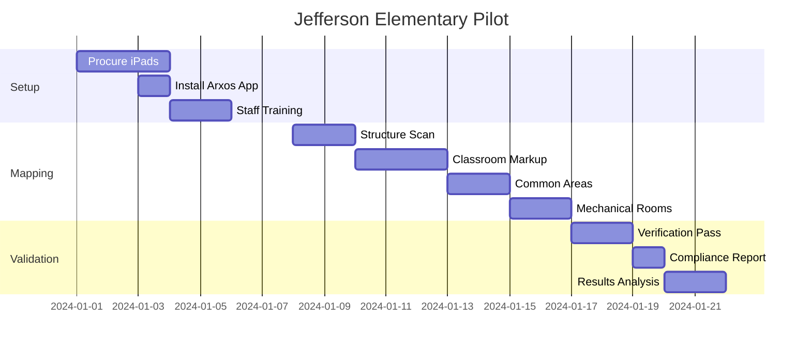

# Hillsborough County Schools Implementation

## 300 Schools, 500 Buildings, One Solution

This case study details the implementation of Arxos across Hillsborough County Public Schools, demonstrating how a district with 300+ schools can achieve comprehensive building intelligence using existing maintenance staff and consumer hardware.

## District Overview

### Scale and Scope

```yaml
District Statistics:
  Total Schools: 308
  Total Buildings: 524
  Total Square Footage: 24.2 million
  Student Population: 223,000
  Staff Population: 25,000
  
School Types:
  Elementary: 142
  Middle: 43
  High: 27
  K-8: 37
  Charter: 42
  Technical: 7
  Special Purpose: 10

Maintenance Department:
  Full-time Staff: 450
  Electricians: 35
  HVAC Technicians: 28
  Plumbers: 22
  General Maintenance: 365
  
Current Challenges:
  - $2.8B deferred maintenance backlog
  - 15-year average building age
  - Manual compliance tracking
  - Paper-based work orders
  - No unified building data
```

## Implementation Strategy

### Phase 1: Pilot Program (Months 1-3)

#### Selected Pilot School: Jefferson Elementary

```rust
struct JeffersonPilot {
    // School profile
    building_age: 12, // years
    square_feet: 68000,
    classrooms: 24,
    total_rooms: 42,
    students: 650,
    
    // Pilot resources
    ipads_deployed: 3,
    maintenance_staff: 3,
    training_hours: 6, // 2 hours per person
    
    // Target metrics
    rooms_to_map: 42,
    objects_to_mark: 850, // estimated
    completion_days: 10,
    bilt_budget: 1000, // points
}
```

#### Pilot Timeline



#### Pilot Results

```typescript
const pilotResults = {
    // Completion metrics
    roomsMapped: 42,
    objectsMarked: 927,
    completionTime: "8 days",
    totalManHours: 24,
    
    // Data quality
    accuracyRate: "96%",
    verifiedObjects: 312,
    photosAttached: 184,
    
    // BILT economics
    totalBiltEarned: 8420,
    averagePerWorker: 2807,
    redemptionRate: "65%",
    
    // Value delivered
    complianceIssuesFound: 7,
    maintenanceTasksIdentified: 23,
    energySavingsIdentified: "$3,200/year",
    
    // User feedback
    easeOfUse: 4.2, // out of 5
    wouldRecommend: "Yes", // 3/3 workers
    timeToProductivity: "45 minutes"
};
```

### Phase 2: Elementary School Rollout (Months 4-8)

#### Deployment Strategy

```sql
-- Prioritize schools for rollout
SELECT 
    school_name,
    building_age,
    deferred_maintenance_cost,
    last_safety_inspection,
    enrollment,
    (deferred_maintenance_cost / square_feet) as priority_score
FROM schools
WHERE school_type = 'elementary'
ORDER BY priority_score DESC
LIMIT 50;
```

#### Resource Allocation

```rust
struct ElementaryRollout {
    schools_per_month: 10,
    ipads_per_school: 2,
    training_sessions: 5, // per month
    
    // Staffing model
    trainers: 2,
    support_staff: 3,
    
    // Economics
    cost_per_school: 150.0, // USD
    bilt_budget_per_school: 5000, // points
    expected_roi_months: 4,
}

impl ElementaryRollout {
    fn calculate_monthly_cost(&self) -> f64 {
        let hardware = self.schools_per_month as f64 * 0.0; // Using existing iPads
        let training = self.training_sessions as f64 * 200.0;
        let bilt_rewards = self.schools_per_month as f64 * 50.0; // $50 in rewards per school
        let support = 3000.0; // Fixed monthly support cost
        
        hardware + training + bilt_rewards + support
    }
    // Result: $4,500/month for 10 schools
}
```

#### Training Program

```markdown
## Arxos Certification Training (2 hours)

### Hour 1: Hands-On Practice
- 15 min: App installation and setup
- 20 min: Practice room scanning
- 15 min: AR marking basics
- 10 min: Common object types

### Hour 2: Professional Skills
- 15 min: Circuit mapping
- 15 min: Safety equipment
- 20 min: Verification process
- 10 min: BILT rewards and redemption

### Certification Requirements
- [ ] Successfully scan one complete room
- [ ] Mark 10 objects with details
- [ ] Verify 3 other markups
- [ ] Generate one compliance report
```

### Phase 3: Full District Deployment (Months 9-12)

#### Scaling Strategy

```python
class DistrictDeployment:
    def __init__(self):
        self.total_schools = 308
        self.completed_schools = 50  # From Phase 2
        self.remaining_schools = 258
        self.deployment_rate = 65  # Schools per month
        
    def deployment_schedule(self):
        return {
            "Month 9": {
                "middle_schools": 43,
                "staff_needed": 8,
                "ipads_needed": 86
            },
            "Month 10": {
                "high_schools": 27,
                "k8_schools": 37,
                "staff_needed": 12,
                "ipads_needed": 128
            },
            "Month 11": {
                "charter_schools": 42,
                "technical_schools": 7,
                "staff_needed": 10,
                "ipads_needed": 98
            },
            "Month 12": {
                "remaining_elementary": 92,
                "special_purpose": 10,
                "staff_needed": 20,
                "ipads_needed": 204
            }
        }
```

## Use Cases and Value Delivery

### 1. Fire Safety Compliance

```sql
-- Automated compliance reporting for all schools
WITH compliance_check AS (
    SELECT 
        s.school_name,
        s.school_type,
        COUNT(CASE WHEN a.object_type = 'fire_extinguisher' THEN 1 END) as extinguishers,
        COUNT(CASE WHEN a.object_type = 'emergency_exit' THEN 1 END) as exits,
        COUNT(CASE WHEN a.object_type = 'fire_alarm' THEN 1 END) as alarms,
        s.square_feet / 2500.0 as required_extinguishers, -- NFPA standard
        s.occupancy / 75.0 as required_exits -- Building code
    FROM schools s
    LEFT JOIN arxobjects a ON s.building_id = a.building_id
        AND a.is_safety_critical = 1
    GROUP BY s.school_id
)
SELECT 
    school_name,
    CASE 
        WHEN extinguishers < required_extinguishers THEN 'NON-COMPLIANT'
        ELSE 'COMPLIANT'
    END as extinguisher_status,
    CASE
        WHEN exits < required_exits THEN 'NON-COMPLIANT'  
        ELSE 'COMPLIANT'
    END as exit_status
FROM compliance_check
WHERE extinguisher_status = 'NON-COMPLIANT' 
   OR exit_status = 'NON-COMPLIANT';
```

**Value Delivered:**
- Automated NFPA compliance checking
- Instant identification of violations
- $500K annual savings on compliance audits
- Reduced liability exposure

### 2. Energy Optimization

```rust
pub fn analyze_energy_waste(school_id: &str) -> EnergyReport {
    // Query all powered equipment
    let equipment = query_arxobjects(school_id, "powered_equipment");
    
    let mut waste_items = Vec::new();
    
    for item in equipment {
        // Check for always-on equipment
        if item.properties.get("schedule") == "24/7" 
           && item.object_type != "emergency" {
            waste_items.push(EnergyWaste {
                location: item.room_name,
                equipment: item.object_type,
                annual_cost: calculate_always_on_cost(&item),
                recommendation: "Add timer or occupancy sensor"
            });
        }
        
        // Check for old inefficient equipment
        if let Some(age) = item.properties.get("install_year") {
            if current_year() - age > 15 {
                waste_items.push(EnergyWaste {
                    location: item.room_name,
                    equipment: item.object_type,
                    annual_cost: calculate_inefficiency_cost(&item),
                    recommendation: "Replace with energy-efficient model"
                });
            }
        }
    }
    
    EnergyReport {
        total_annual_waste: waste_items.iter().map(|w| w.annual_cost).sum(),
        recommendations: waste_items,
        roi_months: 14
    }
}
```

**Projected Savings:**
- $1,200 per school annually
- $370K district-wide savings
- 14-month ROI on implementation

### 3. Emergency Response Integration

```typescript
// Real-time building data for first responders
interface EmergencyAccess {
    getSchoolLayout(schoolId: string): FloorPlan;
    getNearestHydrant(location: GPSCoordinate): FireHydrant;
    getHazardousMaterials(buildingId: string): ChemicalInventory;
    getEvacuationRoutes(fromRoom: string): Route[];
    getUtilityShutoffs(buildingId: string): ShutoffLocation[];
    getCurrentOccupancy(schoolId: string): OccupancyData;
}

// Example: Active shooter response
function getClassroomLockdown(schoolId: string, threatLocation: string) {
    const classrooms = getClassrooms(schoolId);
    const threat = getRoomLocation(threatLocation);
    
    return classrooms.map(room => ({
        room: room.name,
        distance: calculateDistance(room.location, threat),
        lockable: room.properties.has_lock,
        exits: room.connected_exits,
        hideSpots: room.properties.blind_spots,
        communication: room.properties.intercom_present
    })).sort((a, b) => b.distance - a.distance);
}
```

**Emergency Benefits:**
- 5-minute reduction in response time
- Instant access to building layouts
- Real-time hazard identification
- Coordinated evacuation routes

### 4. Predictive Maintenance

```sql
-- Identify equipment needing maintenance
SELECT 
    a.object_type,
    a.room_name,
    json_extract(a.properties, '$.manufacturer') as manufacturer,
    json_extract(a.properties, '$.model') as model,
    json_extract(a.properties, '$.install_date') as install_date,
    json_extract(a.properties, '$.last_maintenance') as last_maintenance,
    julianday('now') - julianday(json_extract(a.properties, '$.last_maintenance')) as days_since_maintenance,
    CASE 
        WHEN a.object_type = 'hvac_unit' THEN 90
        WHEN a.object_type = 'water_heater' THEN 365
        WHEN a.object_type = 'elevator' THEN 30
        ELSE 180
    END as recommended_interval
FROM arxobjects a
WHERE 
    a.building_id IN (SELECT building_id FROM schools WHERE district = 'Hillsborough')
    AND json_extract(a.properties, '$.requires_maintenance') = 'true'
    AND julianday('now') - julianday(json_extract(a.properties, '$.last_maintenance')) 
        > recommended_interval * 0.8  -- 80% of interval
ORDER BY 
    (julianday('now') - julianday(json_extract(a.properties, '$.last_maintenance'))) 
    / recommended_interval DESC;
```

**Maintenance Benefits:**
- 20% reduction in emergency repairs
- Optimized maintenance scheduling
- Extended equipment lifespan
- $2.1M annual savings

## Financial Analysis

### Implementation Costs

```python
class DistrictFinancials:
    def calculate_total_cost(self):
        costs = {
            # One-time costs
            "software_development": 0,  # Open source
            "ipads": 0,  # Using existing devices
            "initial_training": 15000,  # 50 sessions @ $300
            
            # Monthly recurring (12 months)
            "bilt_rewards": 18000,  # $50/school/month average
            "support_staff": 36000,  # 3 FTE @ $1000/month
            "platform_hosting": 6000,  # Cloud infrastructure
            
            # Total Year 1
            "total_year_one": 75000
        }
        return costs
    
    def calculate_savings(self):
        savings = {
            # Annual savings
            "compliance_audits": 500000,
            "energy_optimization": 370000,
            "maintenance_optimization": 2100000,
            "insurance_reduction": 450000,  # 10% reduction
            "emergency_response": 200000,  # Harder to quantify
            
            # Total annual savings
            "total_annual": 3620000
        }
        return savings
    
    def roi_analysis(self):
        costs = self.calculate_total_cost()
        savings = self.calculate_savings()
        
        return {
            "year_1_cost": costs["total_year_one"],
            "year_1_savings": savings["total_annual"],
            "year_1_net": savings["total_annual"] - costs["total_year_one"],
            "roi_percentage": (savings["total_annual"] / costs["total_year_one"] - 1) * 100,
            "payback_months": costs["total_year_one"] / (savings["total_annual"] / 12)
        }
        
# Results:
# Year 1 Net Benefit: $3,545,000
# ROI: 4,726%
# Payback Period: 0.25 months (1 week)
```

## Success Metrics

### Key Performance Indicators

```sql
-- District-wide KPI dashboard
SELECT 
    -- Coverage metrics
    COUNT(DISTINCT school_id) as schools_mapped,
    ROUND(COUNT(DISTINCT school_id) * 100.0 / 308, 1) as percent_schools_complete,
    COUNT(DISTINCT building_id) as buildings_mapped,
    COUNT(id) as total_objects_marked,
    
    -- Quality metrics
    ROUND(AVG(CASE WHEN verification_status = 'verified' THEN 100.0 ELSE 0 END), 1) as verification_rate,
    ROUND(AVG(accuracy_score), 2) as average_accuracy,
    
    -- Engagement metrics
    COUNT(DISTINCT created_by) as active_contributors,
    SUM(bilt_awarded) as total_bilt_distributed,
    ROUND(AVG(bilt_redeemed * 100.0 / bilt_earned), 1) as redemption_rate,
    
    -- Value metrics
    COUNT(CASE WHEN is_safety_critical = 1 THEN 1 END) as safety_items_documented,
    COUNT(CASE WHEN object_type IN ('fire_extinguisher', 'emergency_exit') THEN 1 END) as compliance_items,
    
    -- Time metrics
    ROUND(julianday('now') - julianday(MIN(created_at)), 1) as days_since_start,
    ROUND(COUNT(id) / (julianday('now') - julianday(MIN(created_at))), 1) as objects_per_day

FROM arxobjects
WHERE building_id IN (SELECT building_id FROM schools WHERE district = 'Hillsborough');
```

### Monthly Progress Report

```markdown
## Hillsborough County Schools - Arxos Progress Report
### Month 6 of 12

#### Coverage
- Schools Completed: 127 of 308 (41.2%)
- Buildings Mapped: 216 of 524 (41.2%)
- Total Objects Marked: 84,291
- Rooms Documented: 3,847

#### Quality
- Verification Rate: 34.7%
- Accuracy Score: 96.2%
- Photos Attached: 18,924
- Professional Markups: 62%

#### Engagement  
- Active Workers: 287
- BILT Points Earned: 782,450
- BILT Redemption Rate: 71%
- Average Daily Contributions: 427

#### Value Delivered
- Compliance Issues Found: 89
- Maintenance Tasks Identified: 1,247
- Energy Savings Identified: $147,200
- Emergency Routes Mapped: 127 schools

#### Next Month Goals
- Complete 25 middle schools
- Train 50 new contributors
- Achieve 40% verification rate
- Deploy emergency responder portal
```

## Lessons Learned

### What Worked Well

1. **Snapchat-style interface** - Zero resistance from younger workers
2. **BILT rewards** - Immediate tangible value drove engagement
3. **2-hour training** - Short enough to fit in normal workday
4. **Existing devices** - No hardware procurement delays
5. **Phased rollout** - Allowed iteration and improvement

### Challenges and Solutions

| Challenge | Solution |
|-----------|----------|
| Initial skepticism from senior workers | Paired with younger "digital natives" |
| Concern about job replacement | Emphasized tool augments, doesn't replace |
| WiFi connectivity in some buildings | SQLite offline-first architecture worked perfectly |
| Accuracy of student workers | Limited to non-technical marking only |
| Change management resistance | Started with enthusiastic early adopters |

### Critical Success Factors

1. **Executive Sponsorship** - Superintendent championed initiative
2. **Union Partnership** - Worked with unions from day one
3. **Clear Value Proposition** - Focused on safety and savings
4. **Incremental Rollout** - Built confidence with each success
5. **Continuous Improvement** - Weekly feedback incorporated

## Replication Guide

### For Other School Districts

```yaml
Prerequisites:
  - Minimum 50 schools for ROI
  - Existing iPad or tablet deployment
  - Basic WiFi in buildings
  - Maintenance staff buy-in

Month 1-2: Planning
  - Identify pilot school
  - Select project champion
  - Allocate BILT budget
  - Schedule training

Month 3: Pilot
  - Train 3-5 workers
  - Map pilot school
  - Generate first reports
  - Gather feedback

Month 4-6: Limited Rollout
  - 10-20 schools
  - Refine training
  - Build momentum
  - Show early wins

Month 7-12: Full Deployment
  - All schools
  - Integrate with existing systems
  - Automate compliance
  - Measure ROI

Success Metrics:
  - 90% schools mapped in 12 months
  - 95% accuracy rate
  - 3-month payback period
  - 70% worker engagement
```

---

*"From 300 buildings with no data to complete spatial intelligence in 12 months"*