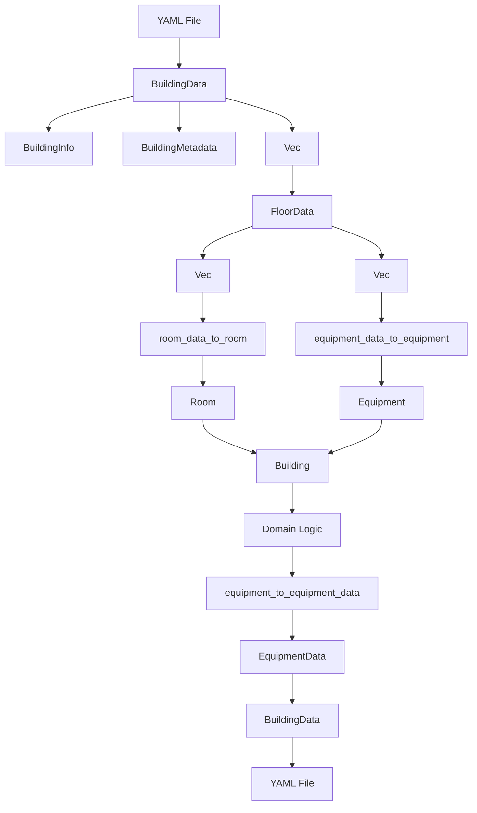

# Core vs YAML Type Differences

This document describes the differences between core domain types (`src/core/`) and YAML serialization types (`src/yaml/`), including field mappings, conversion logic, and when to use each type.

---

## Overview

ArxOS uses two sets of types:

1. **Core Types** (`src/core/`) - Domain models with rich types (enums, structs)
2. **YAML Types** (`src/yaml/`) - Serialization-friendly types optimized for YAML/JSON

**Conversion Functions:** `src/yaml/conversions.rs` provides bidirectional conversion between these types.

---

## Equipment vs EquipmentData

### Core Type: `Equipment`

**Location:** `src/core/equipment.rs`

**Fields:**
```rust
pub struct Equipment {
    pub id: String,
    pub name: String,
    pub path: String,                    // Legacy universal path
    pub address: Option<ArxAddress>,      // New ArxOS Address
    pub equipment_type: EquipmentType,    // Enum: HVAC, Electrical, AV, etc.
    pub position: Position,               // 3D position with coordinate system
    pub properties: HashMap<String, String>,
    pub status: EquipmentStatus,          // Enum: Active, Inactive, Maintenance, etc.
    pub room_id: Option<String>,          // Reference to parent room
}
```

**EquipmentType Enum:**
- `HVAC`
- `Electrical`
- `AV`
- `Furniture`
- `Safety`
- `Plumbing`
- `Network`
- `Other(String)`

**EquipmentStatus Enum:**
- `Active`
- `Inactive`
- `Maintenance`
- `OutOfOrder`
- `Unknown`

---

### YAML Type: `EquipmentData`

**Location:** `src/yaml/mod.rs`

**Fields:**
```rust
pub struct EquipmentData {
    pub id: String,
    pub name: String,
    pub equipment_type: String,           // String representation
    pub system_type: String,              // Derived from equipment_type
    pub position: Point3D,                // Simple 3D point
    pub bounding_box: BoundingBox3D,      // Bounding box
    pub status: EquipmentStatus,          // Enum: Healthy, Warning, Critical, Unknown
    pub properties: HashMap<String, String>,
    pub universal_path: String,           // Legacy universal path
    pub address: Option<ArxAddress>,      // New ArxOS Address
    pub sensor_mappings: Option<Vec<SensorMapping>>,  // Sensor mappings (YAML-only)
}
```

**EquipmentStatus Enum (YAML):**
- `Healthy`
- `Warning`
- `Critical`
- `Unknown`

---

### Key Differences

| Aspect | Core (`Equipment`) | YAML (`EquipmentData`) |
|--------|-------------------|----------------------|
| **Equipment Type** | `EquipmentType` enum | `String` + `system_type: String` |
| **Status** | `Active`, `Inactive`, `Maintenance`, `OutOfOrder`, `Unknown` | `Healthy`, `Warning`, `Critical`, `Unknown` |
| **Position** | `Position` struct with coordinate system | `Point3D` (simple x, y, z) |
| **Bounding Box** | Part of `SpatialProperties` (on Room) | `BoundingBox3D` field |
| **Room Reference** | `room_id: Option<String>` | None (inferred from hierarchy) |
| **Sensor Mappings** | None | `sensor_mappings: Option<Vec<SensorMapping>>` |
| **Path** | `path: String` | `universal_path: String` |
| **Address** | `address: Option<ArxAddress>` | `address: Option<ArxAddress>` |

---

### Conversion Logic

**Equipment → EquipmentData** (`equipment_to_equipment_data`):
- `EquipmentType` enum → `equipment_type` string (via `format!("{:?}")`)
- `EquipmentType` → `system_type` string (mapped: HVAC → "HVAC", etc.)
- `EquipmentStatus` → `EquipmentStatus` (mapped: Active → Healthy, Maintenance → Warning, etc.)
- `Position` → `Point3D` (extracts x, y, z)
- `Position` → `BoundingBox3D` (generates default bounding box)
- `room_id` is dropped (not in YAML type)

**EquipmentData → Equipment** (`equipment_data_to_equipment`):
- `equipment_type` string → `EquipmentType` enum (parsed)
- `EquipmentStatus` → `EquipmentStatus` (mapped: Healthy → Active, Warning → Maintenance, etc.)
- `Point3D` → `Position` (adds coordinate system "building_local")
- `sensor_mappings` is dropped (not in core type)
- `room_id` set to `None` (must be set separately)

---

## Room vs RoomData

### Core Type: `Room`

**Location:** `src/core/room.rs`

**Fields:**
```rust
pub struct Room {
    pub id: String,
    pub name: String,
    pub room_type: RoomType,              // Enum: Classroom, Office, etc.
    pub equipment: Vec<Equipment>,        // Full Equipment objects
    pub spatial_properties: SpatialProperties,  // Position, dimensions, bounding box
    pub properties: HashMap<String, String>,
    pub created_at: DateTime<Utc>,        // Creation timestamp
    pub updated_at: DateTime<Utc>,        // Last modification timestamp
}
```

**RoomType Enum:**
- `Classroom`
- `Laboratory`
- `Office`
- `Gymnasium`
- `Cafeteria`
- `Library`
- `Auditorium`
- `Hallway`
- `Restroom`
- `Storage`
- `Mechanical`
- `Electrical`
- `Other(String)`

---

### YAML Type: `RoomData`

**Location:** `src/yaml/mod.rs`

**Fields:**
```rust
pub struct RoomData {
    pub id: String,
    pub name: String,
    pub room_type: String,                // String representation
    pub area: Option<f64>,                // Room area (optional)
    pub volume: Option<f64>,              // Room volume (optional)
    pub position: Point3D,                // Room position
    pub bounding_box: BoundingBox3D,      // Room bounding box
    pub equipment: Vec<String>,           // Equipment IDs only (not full objects)
    pub properties: HashMap<String, String>,
}
```

---

### Key Differences

| Aspect | Core (`Room`) | YAML (`RoomData`) |
|--------|---------------|-------------------|
| **Room Type** | `RoomType` enum | `String` |
| **Equipment** | `Vec<Equipment>` (full objects) | `Vec<String>` (IDs only) |
| **Spatial Data** | `SpatialProperties` (position, dimensions, bounding box) | `Point3D` + `BoundingBox3D` + `area` + `volume` |
| **Timestamps** | `created_at`, `updated_at` | None |
| **Address** | None (not yet implemented) | None (not yet implemented) |

---

### Conversion Logic

**RoomData → Room** (`room_data_to_room`):
- `room_type` string → `RoomType` enum (parsed via `FromStr`)
- `Point3D` + `BoundingBox3D` → `SpatialProperties` (reconstructed)
- `area` and `volume` are used to calculate dimensions
- `equipment` IDs are not converted (must be populated separately)
- `created_at` and `updated_at` set to current time (information loss)

**Room → RoomData** (not yet implemented):
- Would need to convert `SpatialProperties` → `Point3D` + `BoundingBox3D`
- Would need to calculate `area` and `volume` from dimensions
- Would need to extract equipment IDs from `Vec<Equipment>`
- Timestamps would be lost

---

## Building vs BuildingData

### Core Type: `Building`

**Location:** `src/core/building.rs`

**Fields:**
```rust
pub struct Building {
    pub id: String,
    pub name: String,
    pub path: String,                     // Universal path
    pub created_at: DateTime<Utc>,
    pub updated_at: DateTime<Utc>,
    pub floors: Vec<Floor>,               // Full Floor objects
}
```

---

### YAML Type: `BuildingData`

**Location:** `src/yaml/mod.rs`

**Fields:**
```rust
pub struct BuildingData {
    pub building: BuildingInfo,           // Building metadata
    pub metadata: BuildingMetadata,       // Parser metadata
    pub floors: Vec<FloorData>,           // YAML FloorData objects
    pub coordinate_systems: Vec<CoordinateSystemInfo>,  // Coordinate system info
}
```

**BuildingInfo:**
```rust
pub struct BuildingInfo {
    pub id: String,
    pub name: String,
    pub description: Option<String>,
    pub created_at: DateTime<Utc>,
    pub updated_at: DateTime<Utc>,
    pub version: String,
    pub global_bounding_box: Option<BoundingBox3D>,
}
```

**BuildingMetadata:**
```rust
pub struct BuildingMetadata {
    pub source_file: Option<String>,
    pub parser_version: String,
    pub total_entities: usize,
    pub spatial_entities: usize,
    pub coordinate_system: String,
    pub units: String,
    pub tags: Vec<String>,
}
```

---

### Key Differences

| Aspect | Core (`Building`) | YAML (`BuildingData`) |
|--------|-------------------|----------------------|
| **Structure** | Simple struct | Nested with `BuildingInfo` and `BuildingMetadata` |
| **Metadata** | None | `BuildingMetadata` (parser info, tags, etc.) |
| **Description** | None | `description: Option<String>` |
| **Version** | None | `version: String` |
| **Global Bounding Box** | None | `global_bounding_box: Option<BoundingBox3D>` |
| **Coordinate Systems** | None | `coordinate_systems: Vec<CoordinateSystemInfo>` |
| **Floors** | `Vec<Floor>` (core types) | `Vec<FloorData>` (YAML types) |

---

## Spatial Types

### Core Types

**Location:** `src/core/types.rs`

```rust
pub struct Position {
    pub x: f64,
    pub y: f64,
    pub z: f64,
    pub coordinate_system: String,        // Coordinate system identifier
}

pub struct Dimensions {
    pub width: f64,
    pub height: f64,
    pub depth: f64,
}

pub struct BoundingBox {
    pub min: Position,
    pub max: Position,
}

pub struct SpatialProperties {
    pub position: Position,
    pub dimensions: Dimensions,
    pub bounding_box: BoundingBox,
    pub coordinate_system: String,
}
```

---

### YAML Types

**Location:** `src/spatial/mod.rs` (used by YAML)

```rust
pub struct Point3D {
    pub x: f64,
    pub y: f64,
    pub z: f64,
}

pub struct BoundingBox3D {
    pub min: Point3D,
    pub max: Point3D,
}
```

---

### Key Differences

| Aspect | Core | YAML |
|--------|------|------|
| **Position** | `Position` with coordinate system | `Point3D` (no coordinate system) |
| **Bounding Box** | `BoundingBox` with `Position` (coordinate system) | `BoundingBox3D` with `Point3D` (no coordinate system) |
| **Dimensions** | `Dimensions` struct (width, height, depth) | Calculated from bounding box |
| **Coordinate System** | Explicit field | Implicit (assumed "building_local") |

---

## When to Use Each Type

### Use Core Types When:

- **Domain Logic**: Implementing business logic, validation, or operations
- **In-Memory Operations**: Working with data in memory (not serializing)
- **Type Safety**: Need strong typing with enums and structs
- **Rich Types**: Need enums, timestamps, or complex relationships

**Example:**
```rust
use crate::core::{Equipment, EquipmentType, EquipmentStatus};

let mut equipment = Equipment::new(
    "VAV-301".to_string(),
    "/path/to/vav".to_string(),
    EquipmentType::HVAC
);
equipment.status = EquipmentStatus::Active;
```

---

### Use YAML Types When:

- **Serialization**: Saving/loading to/from YAML files
- **File I/O**: Reading or writing building data files
- **API Responses**: Returning data in JSON/YAML format
- **Metadata Handling**: Need parser metadata, tags, or coordinate system info

**Example:**
```rust
use crate::yaml::{BuildingData, BuildingYamlSerializer};

let serializer = BuildingYamlSerializer::new();
let yaml_str = serializer.to_yaml(&building_data)?;
std::fs::write("building.yaml", yaml_str)?;
```

---

## Conversion Flow

### Loading from YAML

```
YAML File
  ↓
BuildingData (YAML type)
  ↓
[Conversion Functions]
  ↓
Building (Core type)
  ↓
Domain Logic Operations
```

**Conversion Functions:**
- `room_data_to_room()` - Convert `RoomData` → `Room`
- `equipment_data_to_equipment()` - Convert `EquipmentData` → `Equipment`

---

### Saving to YAML

```
Building (Core type)
  ↓
[Conversion Functions]
  ↓
BuildingData (YAML type)
  ↓
YAML Serialization
  ↓
YAML File
```

**Conversion Functions:**
- `equipment_to_equipment_data()` - Convert `Equipment` → `EquipmentData`
- Room → RoomData conversion (not yet implemented)

---

## Metadata Handling

### YAML-Only Metadata

The following metadata exists only in YAML types and is not present in core types:

- **Parser Metadata** (`BuildingMetadata`):
  - `source_file` - Original IFC file path
  - `parser_version` - ArxOS version that parsed the file
  - `total_entities` - Total number of entities
  - `spatial_entities` - Number of spatial entities
  - `tags` - User-defined tags

- **Sensor Mappings** (`SensorMapping`):
  - Only in `EquipmentData`
  - Maps sensors to equipment with thresholds
  - Used for sensor data processing

- **Coordinate System Info** (`CoordinateSystemInfo`):
  - Only in `BuildingData`
  - Defines coordinate system transformations
  - Used for spatial calculations

---

## Conversion Flow Diagram



---

## Field Mapping Reference

### Equipment Field Mapping

| Core Field | YAML Field | Conversion Notes |
|------------|------------|------------------|
| `id` | `id` | Direct copy |
| `name` | `name` | Direct copy |
| `path` | `universal_path` | Direct copy |
| `address` | `address` | Direct copy |
| `equipment_type` (enum) | `equipment_type` (string) | `format!("{:?}")` |
| `equipment_type` (enum) | `system_type` (string) | Mapped: HVAC → "HVAC" |
| `position` | `position` | Extract x, y, z |
| `status` (enum) | `status` (enum) | Mapped: Active → Healthy |
| `properties` | `properties` | Direct copy |
| `room_id` | (none) | Dropped in conversion |
| (none) | `sensor_mappings` | YAML-only, dropped in conversion |

---

### Room Field Mapping

| Core Field | YAML Field | Conversion Notes |
|------------|------------|------------------|
| `id` | `id` | Direct copy |
| `name` | `name` | Direct copy |
| `room_type` (enum) | `room_type` (string) | `format!("{}")` or parse |
| `equipment` (Vec<Equipment>) | `equipment` (Vec<String>) | Extract IDs only |
| `spatial_properties.position` | `position` | Extract x, y, z |
| `spatial_properties.bounding_box` | `bounding_box` | Convert Position → Point3D |
| `spatial_properties.dimensions` | `area`, `volume` | Calculate from dimensions |
| `properties` | `properties` | Direct copy |
| `created_at` | (none) | Lost in conversion |
| `updated_at` | (none) | Lost in conversion |

---

### Building Field Mapping

| Core Field | YAML Field | Conversion Notes |
|------------|------------|------------------|
| `id` | `building.id` | Direct copy |
| `name` | `building.name` | Direct copy |
| `path` | (none) | Lost in conversion |
| `created_at` | `building.created_at` | Direct copy |
| `updated_at` | `building.updated_at` | Direct copy |
| `floors` | `floors` | Convert Vec<Floor> → Vec<FloorData> |
| (none) | `building.description` | YAML-only |
| (none) | `building.version` | YAML-only |
| (none) | `building.global_bounding_box` | YAML-only |
| (none) | `metadata` | YAML-only |
| (none) | `coordinate_systems` | YAML-only |

---

## Status Enum Mapping

### EquipmentStatus Mapping

**Core → YAML:**
- `Active` → `Healthy`
- `Maintenance` → `Warning`
- `Inactive` → `Critical`
- `OutOfOrder` → `Critical`
- `Unknown` → `Unknown`

**YAML → Core:**
- `Healthy` → `Active`
- `Warning` → `Maintenance`
- `Critical` → `Inactive`
- `Unknown` → `Unknown`

**Note:** This mapping is not perfect - `OutOfOrder` is lost when converting to YAML (maps to `Critical`), and `Inactive` maps to `Critical` which may not be accurate.

---

## Examples

### Example 1: Loading from YAML

```rust
use crate::yaml::{BuildingData, BuildingYamlSerializer};
use crate::yaml::conversions::{room_data_to_room, equipment_data_to_equipment};

// Load YAML file
let yaml_str = std::fs::read_to_string("building.yaml")?;
let building_data: BuildingData = serde_yaml::from_str(&yaml_str)?;

// Convert to core types
let mut rooms = Vec::new();
for floor_data in &building_data.floors {
    for room_data in &floor_data.rooms {
        let room = room_data_to_room(room_data);
        rooms.push(room);
    }
}
```

---

### Example 2: Converting Equipment

```rust
use crate::core::Equipment;
use crate::yaml::{EquipmentData, conversions::equipment_to_equipment_data};

// Core type
let equipment = Equipment {
    id: "equip-001".to_string(),
    name: "VAV-301".to_string(),
    equipment_type: EquipmentType::HVAC,
    status: EquipmentStatus::Active,
    // ... other fields
};

// Convert to YAML type
let equipment_data = equipment_to_equipment_data(&equipment);

// Now can serialize to YAML
let yaml_str = serde_yaml::to_string(&equipment_data)?;
```

---

### Example 3: Status Conversion

```rust
use crate::core::EquipmentStatus;
use crate::yaml::EquipmentStatus as YamlEquipmentStatus;

// Core status
let core_status = EquipmentStatus::Active;

// Convert to YAML status
let yaml_status = match core_status {
    EquipmentStatus::Active => YamlEquipmentStatus::Healthy,
    EquipmentStatus::Maintenance => YamlEquipmentStatus::Warning,
    EquipmentStatus::Inactive | EquipmentStatus::OutOfOrder => YamlEquipmentStatus::Critical,
    EquipmentStatus::Unknown => YamlEquipmentStatus::Unknown,
};
```

---

## Future Unification

The plan is to eventually unify these types by:

1. **Adding serde derives to core types** - Make core types directly serializable
2. **Removing YAML types** - Use core types directly for serialization
3. **Moving metadata to core types** - Add metadata fields to core types if needed
4. **Simplifying conversions** - Conversion functions become identity functions

**Current Status:** Both type systems coexist for backward compatibility and gradual migration.

---

## Related Files

- **Core Types:** `src/core/equipment.rs`, `src/core/room.rs`, `src/core/building.rs`
- **YAML Types:** `src/yaml/mod.rs`
- **Conversions:** `src/yaml/conversions.rs`
- **Serialization:** `src/yaml/mod.rs` (BuildingYamlSerializer)

---

**Last Updated:** January 2025  
**Version:** 2.0.0

